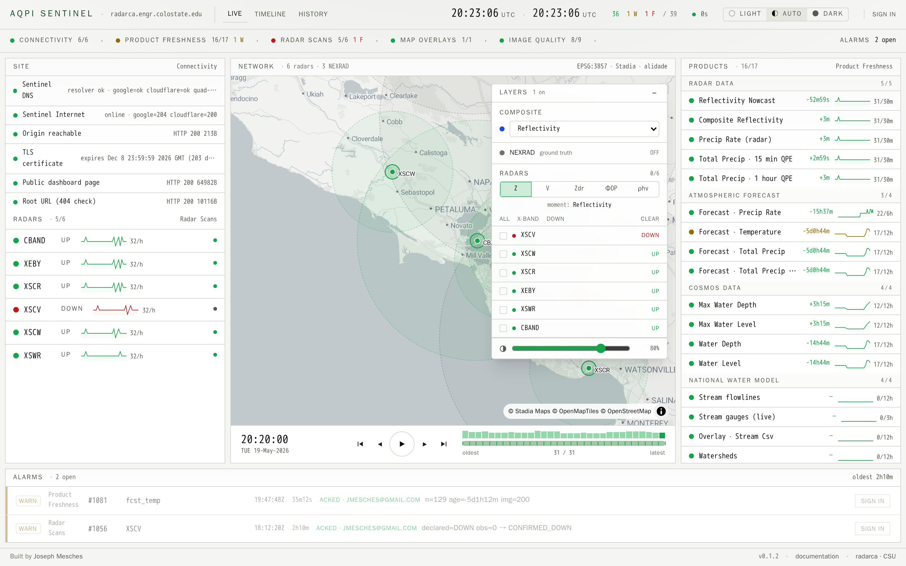
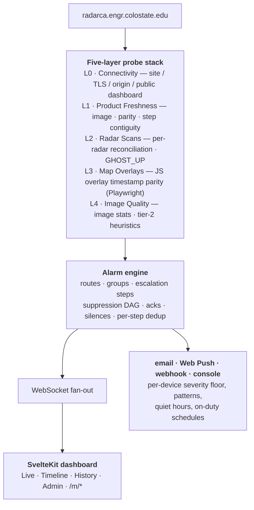
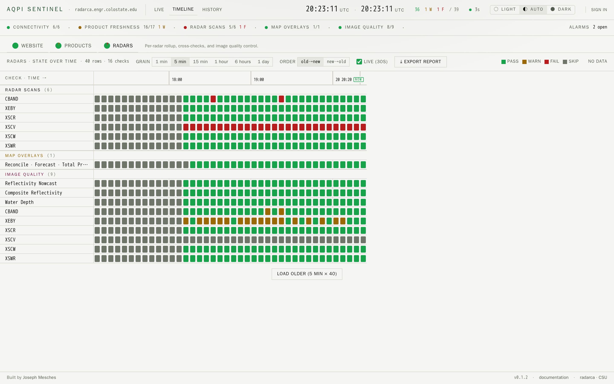

# AQPI Sentinel

> Hierarchical, end-to-end health monitoring for **[radarca.engr.colostate.edu](https://radarca.engr.colostate.edu/public)** — the CSU-CHILL / AQPI X-band radar network dashboard.



Sentinel watches the upstream stack from five angles, turns anomalies into routed alarms (email · Web Push · webhook · console), and ships a CSU-themed operations console plus an iPhone-native PWA at `/m/*`.

[**Full documentation →**](https://jkmesches.github.io/AQPI-Sentinel/) · [Architecture](docs/ARCHITECTURE.md) · [Maintenance](docs/MAINTENANCE.md) · [Changelog](CHANGELOG.md)

---

## Status

**v0.4.4** — running 24×7 against radarca, and deployable by another team: self-contained compose stack with a bundled reverse proxy, verified backups, and a data export/import path. Apache-2.0, with tagged container images published publicly to GHCR (`ghcr.io/jkmesches/sentinel-{backend,frontend}`) so a deploy needs no login.

- **45 checks** across 5 stages (L0/L1/L2/L3/L4-T1T2), self-registered via `@register`.
- **21-table Postgres 16 schema**, auto-applied on backend start (no migrations to run).
- **Alarm engine** with routes, groups (schedule-gated bundles of users), escalation policies, acks, silences, dependency-graph suppression, and per-step recipient dedup.
- **Three-tier severity model** (v0.1.2): `info` = attention-required, `warn` = broken (action required), `critical` = sustained outage. Auto-promotes `warn → critical` after 30 minutes.
- **Web Push** with per-device routing (severity floor, pattern matching, async delay, on-duty schedule, quiet hours). Smart-delay drops the push if the alarm resolves or is acked first.
- **Content-addressed image archive** — every frame Sentinel serves is stored and de-duplicated by SHA-256, so scrubbing history costs the upstream nothing. Optional prewarm (`SENTINEL_PREWARM_ENABLED`, off by default) captures *every* published moment and per-elevation tilt rather than only what someone has looked at; for tilts the archive reaches further back than the origin's own 16-minute window.
- **Daily activity report** — one email each morning covering the previous 24 hours, with a row per radar and per product and a link from every row to the checks behind it. Organized by subject rather than by alarm, so a radar that was down all night still appears even when nobody opened an alarm for it. Off by default; configured at `/admin/digest`.
- **Mobile PWA** (`/m/*`) — install on iPhone Safari; 4-tab bottom nav (Status / Timeline / Alarms / More) with composites + playback, ack/unack, dedicated push-routing editor.

## How it works



[Full architecture →](docs/ARCHITECTURE.md)

## Timeline view

State-over-time grid pivoted on `(check × time bucket)`. Selectable grain (1m / 5m / 15m / 1h / 6h / 1d), per-cell drill-down with the verify-yourself reasoning trail + captured L4 frame, and a "Export Report" CSV that respects every active filter.



## Quickstart

Prereqs: **Docker** (for Postgres), **Python 3.12**, **Node 20+**.

```bash
git clone https://github.com/jkmesches/AQPI-Sentinel sentinel
cd sentinel

python3 -m venv .venv
.venv/bin/pip install -r requirements.txt
.venv/bin/playwright install chromium      # ~250 MB one-time

( cd frontend && npm install )

cp .env.example .env                        # set SENTINEL_ADMIN_EMAIL + SENTINEL_ADMIN_PASSWORD
make dev
```

After ~10 s:

```
sentinel up
  backend  : http://127.0.0.1:8000  (log: /tmp/sentinel-be.log)
  frontend : http://127.0.0.1:5173  (log: /tmp/sentinel-fe.log)
```

Open <http://localhost:5173>. First check tick runs within a second and the dashboard populates with live upstream conditions.

Make targets: `make dev | status | logs | stop | restart | restart-fe | restart-be | pg-shell | pg-stop`. `make restart-fe` is the one you'll reach for most — it wipes Vite's dep cache after structural Svelte edits.

[Getting started in detail →](docs/01-getting-started.md)

## Production deploy

One command brings up the whole stack — reverse proxy with TLS,
Postgres, backend, frontend. Nothing else to install.

```bash
cp ops/.env.deploy.example ops/.env
chmod 600 ops/.env
$EDITOR ops/.env            # POSTGRES_PASSWORD + admin account are required

bash ops/preflight.sh       # catches config problems before anything starts

docker compose -f ops/docker-compose.deploy.yml --env-file ops/.env up -d
```

Defaults to `:80` on any hostname, so it works with no DNS. For TLS set
two variables (`SENTINEL_SITE_ADDRESS`, `SENTINEL_TLS_DIRECTIVE`) — see
`ops/Caddyfile`. Pin `SENTINEL_TAG` to a release rather than `latest`
for a deployment that does not change under you.

Already run your own proxy? Use `ops/docker-compose.ghcr.yml` instead.
Need to build from source (air-gapped, or a branch)?
`ops/docker-compose.prod.yml` with `--build`.

[Deployment & backup recipes →](docs/02-deployment.md)

## Adding a check

One file under `backend/checks/`, a `@register` line at the bottom, optionally an import in `backend/checks/__init__.py`. The scheduler, store, alarm engine, API, and frontend all consume the generic `CheckResult` envelope — no central list to update. New stages are just labels: `INFRA` for storage-cluster heartbeats works the same way as `L5`.

[Walkthrough →](docs/13-extending-checks.md)

## Documentation

| Doc | Read when |
|---|---|
| [`docs/01-getting-started.md`](docs/01-getting-started.md) | First time running Sentinel |
| [`docs/02-deployment.md`](docs/02-deployment.md) | Standing up production |
| [`docs/03-administration.md`](docs/03-administration.md) | Tour of every `/admin/*` page |
| [`docs/MAINTENANCE.md`](docs/MAINTENANCE.md) | Something's broken / day-2 ops |
| [`docs/05-troubleshooting.md`](docs/05-troubleshooting.md) | A specific failure mode |
| [`docs/ARCHITECTURE.md`](docs/ARCHITECTURE.md) | Want to understand the codebase |
| [`docs/13-extending-checks.md`](docs/13-extending-checks.md) | Adding a check |
| [`docs/14-extending-api.md`](docs/14-extending-api.md) | Adding an API endpoint |
| [`docs/15-extending-ui.md`](docs/15-extending-ui.md) | Frontend changes |
| [`docs/16-alarm-engine.md`](docs/16-alarm-engine.md) | Custom alarm sinks / routing internals |
| [`docs/93-severity-audit.md`](docs/93-severity-audit.md) | Per-check classification under the v0.1.2 severity model |
| [`docs/92-glossary.md`](docs/92-glossary.md) | "What does *X* mean?" |
| [`docs/06-porting-to-other-upstreams.md`](docs/06-porting-to-other-upstreams.md) | Pointing Sentinel at a non-radarca system |
| [`docs/radarca-public-characterization.md`](docs/radarca-public-characterization.md) | Reverse-engineering reference for radarca's API |

## License

**[Apache-2.0](LICENSE).** Use it, run it, modify it, ship it. If you point it at a
different upstream, [`docs/06-porting-to-other-upstreams.md`](docs/06-porting-to-other-upstreams.md)
is the map of what's generic and what is radar-specific.

Copyright 2026 Joseph Mesches. Written independently, with no obligation,
contract, or attribution to any other person or institution. Sentinel is **not**
a work product of Colorado State University, the CSU CHILL National Radar
Facility, Dr. V. Chandrasekar or their lab, or the AQPI program, and is not
affiliated with or endorsed by any of them. It reads only their public web
endpoints; references to those names describe the monitoring target, not
ownership or sponsorship. See [`NOTICE`](NOTICE).

Built by [Joseph Mesches](https://github.com/jkmesches).
