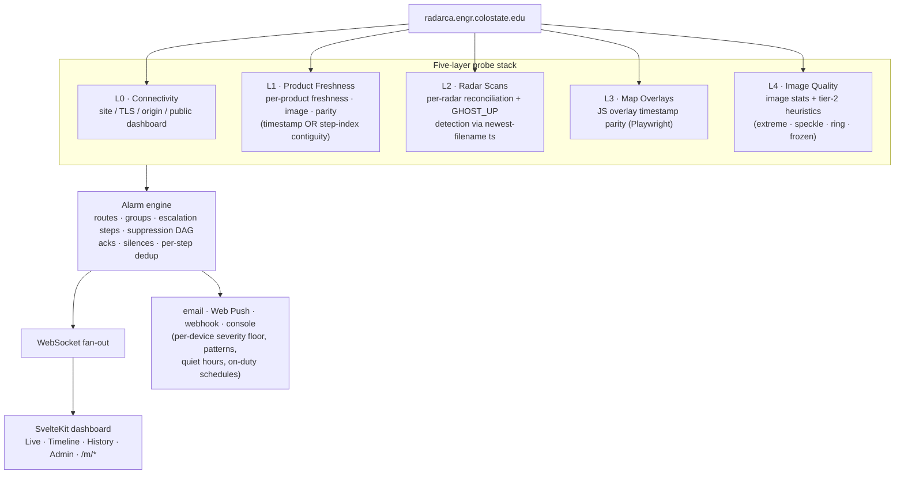

# AQPI Sentinel

> Hierarchical, end-to-end health monitoring for **[radarca.engr.colostate.edu](https://radarca.engr.colostate.edu/public)** — the CSU-CHILL / AQPI X-band radar network dashboard.


Sentinel watches the upstream stack from five angles, turns anomalies into routed alarms (email · Web Push · webhook · console), and ships a CSU-themed operations console plus an iPhone-native PWA at `/m/*`.

[**Full documentation →**](https://jkmesches.github.io/SentinelProject/) · [Architecture](docs/ARCHITECTURE.md) · [Maintenance](docs/MAINTENANCE.md) · [Changelog](CHANGELOG.md)

---

## Status

**v0.1.2** — feature-complete; running 24×7 against radarca. Tagged container images published to GHCR (`ghcr.io/jkmesches/sentinel-{backend,frontend}`).

- **39 checks** across 5 stages (L0/L1/L2/L3/L4-T1T2), self-registered via `@register`.
- **18-table Postgres 16 schema**, auto-applied on backend start (no migrations to run).
- **Alarm engine** with routes, groups (schedule-gated bundles of users), escalation policies, acks, silences, dependency-graph suppression, and per-step recipient dedup.
- **Three-tier severity model** (v0.1.2): `info` = attention-required, `warn` = broken (action required), `critical` = sustained outage. Auto-promotes `warn → critical` after 30 minutes.
- **Web Push** with per-device routing (severity floor, pattern matching, async delay, on-duty schedule, quiet hours). Smart-delay drops the push if the alarm resolves or is acked first.
- **Mobile PWA** (`/m/*`) — install on iPhone Safari; 4-tab bottom nav (Status / Timeline / Alarms / More) with composites + playback, ack/unack, dedicated push-routing editor.

## How it works



[Full architecture →](docs/ARCHITECTURE.md)

## Timeline view

State-over-time grid pivoted on `(check × time bucket)`. Selectable grain (1m / 5m / 15m / 1h / 6h / 1d), per-cell drill-down with the verify-yourself reasoning trail + captured L4 frame, and a "Export Report" CSV that respects every active filter.


## Quickstart

Prereqs: **Docker** (for Postgres), **Python 3.12**, **Node 20+**.

```bash
git clone https://github.com/jkmesches/SentinelProject sentinel
cd sentinel

python3 -m venv .venv
.venv/bin/pip install -r requirements.txt
.venv/bin/playwright install chromium      # ~250 MB one-time

( cd frontend && npm install )

cp .env.example .env                        # set SENTINEL_ADMIN_EMAIL + SENTINEL_ADMIN_PASSWORD
make dev
```

After ~10 s:

```
sentinel up
  backend  : http://127.0.0.1:8000  (log: /tmp/sentinel-be.log)
  frontend : http://127.0.0.1:5173  (log: /tmp/sentinel-fe.log)
```

Open <http://localhost:5173>. First check tick runs within a second and the dashboard populates with live upstream conditions.

Make targets: `make dev | status | logs | stop | restart | restart-fe | restart-be | pg-shell | pg-stop`. `make restart-fe` is the one you'll reach for most — it wipes Vite's dep cache after structural Svelte edits.

[Getting started in detail →](docs/01-getting-started.md)

## Production deploy

Pull tagged images from GHCR:

```bash
cp ops/.env.prod.example ops/.env.prod      # fill in values, one-time

SENTINEL_TAG=v0.1.2 docker compose -f ops/docker-compose.ghcr.yml \
  --env-file ops/.env.prod pull
SENTINEL_TAG=v0.1.2 docker compose -f ops/docker-compose.ghcr.yml \
  --env-file ops/.env.prod up -d
```

`SENTINEL_TAG=latest` tracks `main`. Building locally instead works too — swap to `ops/docker-compose.prod.yml` with `--build`.

[Deployment & backup recipes →](docs/02-deployment.md)

## Adding a check

One file under `backend/checks/`, a `@register` line at the bottom, optionally an import in `backend/checks/__init__.py`. The scheduler, store, alarm engine, API, and frontend all consume the generic `CheckResult` envelope — no central list to update. New stages are just labels: `INFRA` for storage-cluster heartbeats works the same way as `L5`.

[Walkthrough →](docs/13-extending-checks.md)

## Documentation

| Doc | Read when |
|---|---|
| [`docs/01-getting-started.md`](docs/01-getting-started.md) | First time running Sentinel |
| [`docs/02-deployment.md`](docs/02-deployment.md) | Standing up production |
| [`docs/03-administration.md`](docs/03-administration.md) | Tour of every `/admin/*` page |
| [`docs/MAINTENANCE.md`](docs/MAINTENANCE.md) | Something's broken / day-2 ops |
| [`docs/05-troubleshooting.md`](docs/05-troubleshooting.md) | A specific failure mode |
| [`docs/ARCHITECTURE.md`](docs/ARCHITECTURE.md) | Want to understand the codebase |
| [`docs/13-extending-checks.md`](docs/13-extending-checks.md) | Adding a check |
| [`docs/14-extending-api.md`](docs/14-extending-api.md) | Adding an API endpoint |
| [`docs/15-extending-ui.md`](docs/15-extending-ui.md) | Frontend changes |
| [`docs/16-alarm-engine.md`](docs/16-alarm-engine.md) | Custom alarm sinks / routing internals |
| [`docs/93-severity-audit.md`](docs/93-severity-audit.md) | Per-check classification under the v0.1.2 severity model |
| [`docs/92-glossary.md`](docs/92-glossary.md) | "What does *X* mean?" |
| [`docs/06-porting-to-other-upstreams.md`](docs/06-porting-to-other-upstreams.md) | Pointing Sentinel at a non-radarca system |
| [`docs/radarca-public-characterization.md`](docs/radarca-public-characterization.md) | Reverse-engineering reference for radarca's API |

Interactive API: <http://localhost:8000/docs> (Swagger UI) and `/redoc`.

## License

Internal CSU/CHILL project. Not currently licensed for redistribution.

Built by [Joseph Mesches](https://github.com/jkmesches) for [Dr. V. Chandrasekar's](https://chill.colostate.edu/) AQPI program at CSU CIRA / ECE.
