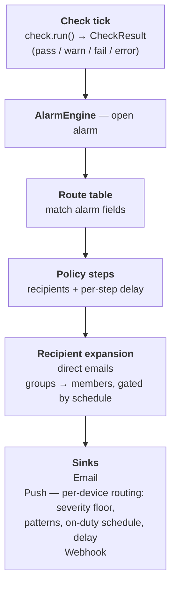
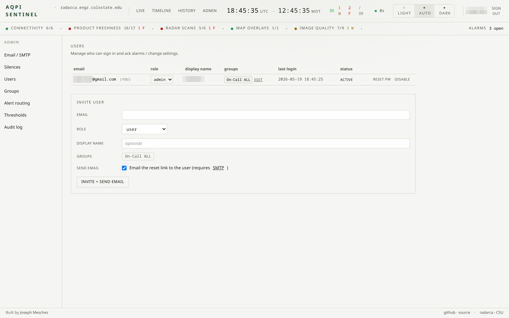
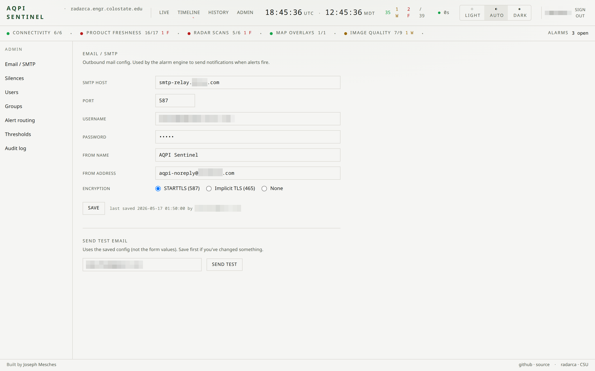
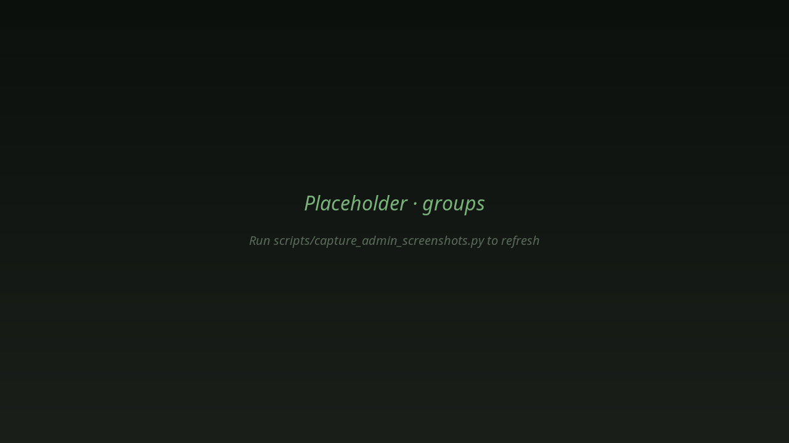
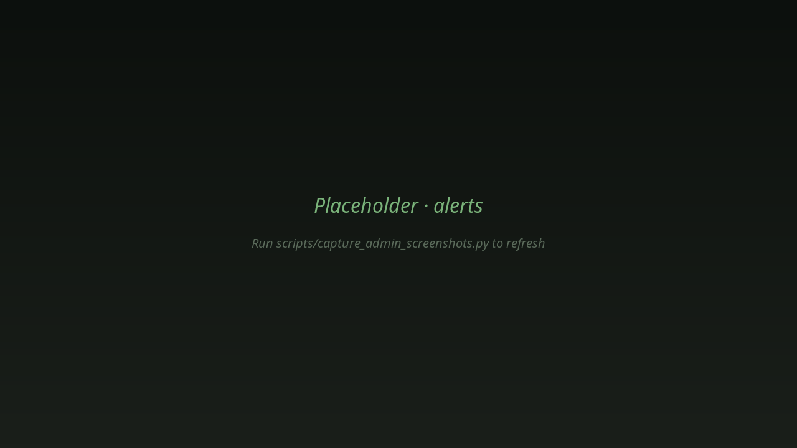
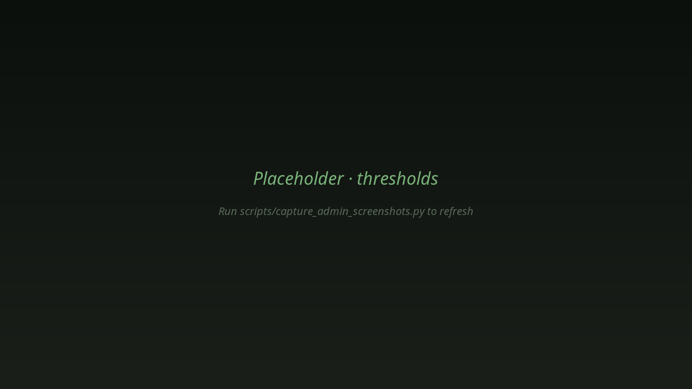
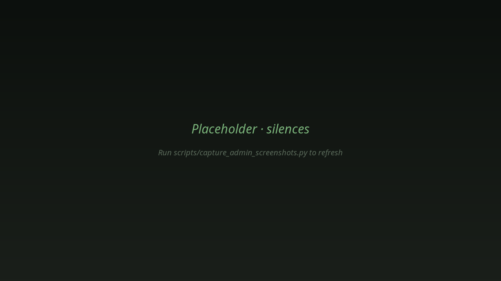
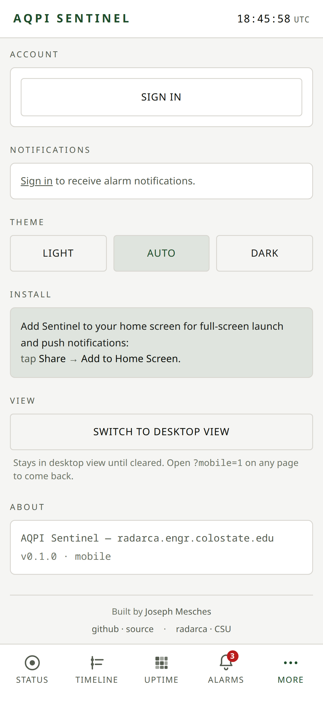
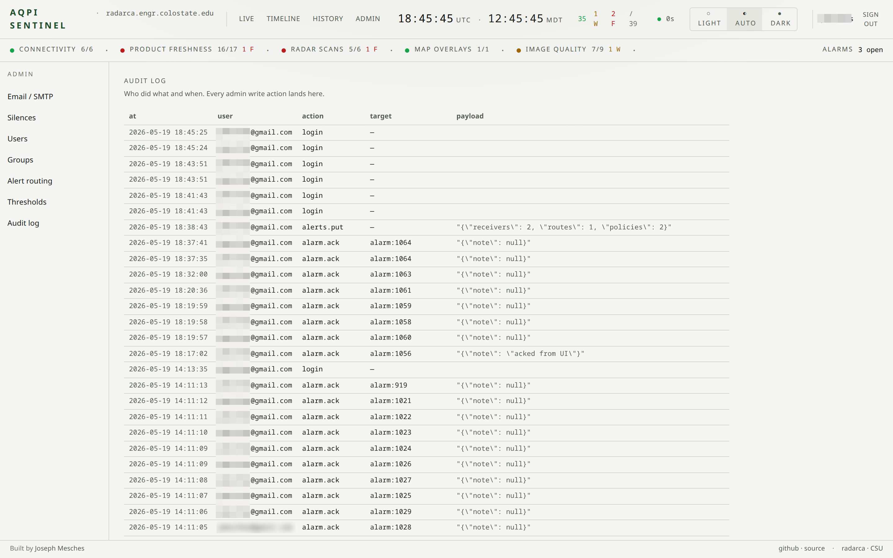

# Administration

This doc walks through every admin page in Sentinel, what it
controls, and how the pieces fit together. Companion to
[`02-deployment.md`](02-deployment.md) (you have a running stack)
and [`04-maintenance.md`](MAINTENANCE.md) (day-2 ops).

> **Screenshots.** Inline figures reference files in
> `docs/images/admin-*.png`. Run
> `scripts/capture_admin_screenshots.py` against your deploy to
> populate / refresh them — the script logs in via the standard
> auth flow and saves a PNG per admin page. The doc still reads
> cleanly without them; images are sugar.

---

## 1. The alert lifecycle — read this first

Every later section makes more sense once this picture is in your
head. When something goes wrong upstream, here's what happens:



Vocabulary:

- **Check run** — one tick of one monitor. Produces a `CheckResult`
  with a status (`pass`, `warn`, `fail`, `error`, `skip`).
- **Alarm** — a row in the `alarms` table opened when a check
  returns a non-`pass`/non-`skip` status. Has its own severity
  (`warn` or `critical`) which is derived from the underlying status
  and can be promoted by duration.
- **Route** — a rule in `/admin/alerts` that maps "alarms matching X"
  to "send through escalation policy Y".
- **Policy** — an ordered list of escalation steps. Step 0 fires
  immediately; later steps fire after their per-step delay if the
  alarm is still open and unacked.
- **Recipient** — an email address, a group, or both.
- **Group** — a named bundle of users + a notification schedule. At
  dispatch time the group is expanded to its currently-on-duty
  members; off-duty members are skipped silently.

Whenever a notification doesn't land, this pipeline is what to trace
backwards.

---

## 2. Users and roles · `/admin/users`



**Two roles:**

- `user` — read-only operator. Can see the dashboard, drill into
  alarms, ack/unack them, view history. Cannot touch admin pages.
- `admin` — everything `user` can do, plus the full configuration
  surface (this doc).

There's no per-feature ACL. The distinction is binary and
intentional: Sentinel's admin surface is small enough that
fine-grained permissions would be more confusing than useful.

### Adding a user

Click **Add user**, enter email + display name + role. The new row
appears immediately but has no password yet — Sentinel issues a
**reset link** the new user clicks to set their own password. Copy
the link from the action menu and send it to them out-of-band (or
let SMTP deliver it if you've configured email).

The reset link expires in 24 hours. Re-issue from the same row's
action menu if it lapses.

### Disabling vs deleting

**Disable** is what you want 99% of the time. Disabled users keep
their history (audit log entries, ack records); they just can't log
in or receive notifications. Re-enabling restores access without
loss.

**Delete** wipes the row. Use only when you're cleaning up genuinely
mistaken accounts (typo'd email, test users). Audit-log references
to a deleted user are preserved as their literal email — they don't
become dangling FKs.

### Forgotten passwords

The user's own way: the login page's "Forgot password?" link
generates a reset email. Requires SMTP.

The admin's way: from `/admin/users`, click the user's row, then
**Reset password**. Issues a fresh reset link to copy.

### Locked out of admin

If you've disabled the last admin (or lost the bootstrap admin's
password and SMTP isn't configured), recover from psql:

```sql
-- Re-enable an admin
UPDATE users SET disabled_at = NULL, role = 'admin'
WHERE email = 'you@example.com';

-- Force a password reset by clearing the hash; user can then use
-- the public reset flow.
UPDATE users SET password_hash = NULL WHERE email = 'you@example.com';
```

The bootstrap-admin env vars (`SENTINEL_ADMIN_*`) only apply when
the `users` table is empty — they don't reset existing users.

---

## 3. Email channel · `/admin/email`



Email is one of Sentinel's two notification surfaces (the other is
Web Push). Both are independent and optional. A push-only deploy is
a fine choice for small teams.

**Fields:**

| Field | Notes |
|---|---|
| Enabled | Master switch. Off = no email sends, even if everything else is filled in. |
| SMTP host | e.g. `smtp.mailgun.org`. No protocol prefix. |
| SMTP port | `587` for STARTTLS (modern default), `465` for implicit TLS, `25` last-resort plain. |
| Use TLS | On for `587` (STARTTLS) and `465`. Off only for trusted-LAN `25`. |
| SMTP user | Provider's auth name. Often an API-token user (`apikey` for SendGrid, your server token for Postmark). |
| SMTP password | The auth secret. **Stored encrypted at rest.** |
| From address | Must be on a domain you control + have configured SPF/DKIM for. Failure mode is silent spam-folder routing. |
| From name | "AQPI Sentinel" or similar — what recipients see in the From line. |

The provider-specific recipes (Mailgun, SendGrid, SES, Postmark) are
in [`02-deployment.md` § 6](02-deployment.md#6-smtp-for-email-alerts).

### Send test email

Below the form, **Send test email** delivers a minimal "Sentinel
SMTP test" message to your own admin email address. Use this **after
any config change** — it exercises the full handshake (auth, TLS,
from-verification) without firing a routing rule. If this works, the
problem with real alerts is downstream (routing, recipients,
groups), not SMTP.

### Two config surfaces

The settings on this page are stored in `settings.smtp` (jsonb,
Postgres). A YAML fallback at `alerts.yaml` (project root) is used
only when the DB row is empty — handy for source deploys where you
want config in the file tree.

**Precedence:** DB wins. If the DB has any SMTP config (even
partially filled), `alerts.yaml`'s SMTP block is ignored.

---

## 4. Groups and schedules · `/admin/groups`



A group is **a set of users + a schedule**. At dispatch time
Sentinel expands the group, filters to members currently "on duty"
per the schedule, then delivers to each filtered member exactly
once (de-duped across overlapping groups).

If you don't need rotation logic, you don't need groups at all —
recipient rows in `/admin/alerts` can carry direct emails.

### Schedule kinds

| Kind | Used for |
|---|---|
| `always` | The group is always on duty. The only reason to wrap people in an `always` group instead of listing them directly is the audit / change-management benefit (edit one row, all references update). |
| `weekly` | Active on selected weekdays during selected time windows. Most rotations. |
| `biweekly` | Same as weekly, alternating between "on weeks" and "off weeks" against an anchor date you set. Two-week rotations. |

### Time windows

Each weekly / biweekly group can have **multiple** time windows.
e.g. a group could be on duty Mon–Thu 09:00–17:00 AND Fri
09:00–14:00.

Overnight windows wrap midnight automatically: a window of `22:00 →
06:00` means 22:00 today through 06:00 tomorrow.

### Downtime

Two kinds of mute-windows alongside the on-duty schedule:

- **One-off downtime** — vacation, planned absence, an off-site
  conference. Datetime-local picker (UTC). Suppresses notifications
  for the picked range regardless of the schedule.
- **Recurring downtime** — quiet hours that repeat weekly. Nightly
  10pm–6am, lunchtime, weekends-only. Configurable per group.

Downtime composes with the on-duty schedule via **AND**: a member
must be both on-duty AND not in any downtime window.

### Parent groups

A group can reference a parent group. The parent's schedule + the
child's schedule both apply (AND-merged). Useful for "the night-shift
sub-team inherits the team-wide downtime".

### Preview pane

Above the save button, a small status block answers two questions
live as you edit: **Is this group on duty right now?** and **Next
on-window starts at...**. Use it to sanity-check overnight wraps and
biweekly anchors.

### Worked example: on-call rotation

Two-week alternating rotation between Alice and Bob, weekdays only,
24/7 coverage:

1. Create group `OnCall-Week-A`, kind `biweekly`, anchor `2026-01-06`
   (a Monday), weekdays `Mon-Sun`, time window `00:00 → 23:59`,
   members `[Alice]`.
2. Create group `OnCall-Week-B`, kind `biweekly`, anchor
   `2026-01-13` (the following Monday), same windows, members
   `[Bob]`.
3. In `/admin/alerts`, route critical alarms to a recipient that
   names both groups. Sentinel picks the one currently on-duty.

---

## 5. Alert routing · `/admin/alerts`



This page has two halves. The top — **Routing rules** — decides
which alarms get notified and through which policy. The bottom —
**Recipients** — defines the policies and their escalation steps.

### Routing rules

Each rule is a `match` block, an optional `when` block (extra
conditions), and a `then` block (which policy to invoke).

**Match block — what alarm fields to filter on:**

| Field | Values | Notes |
|---|---|---|
| `stage` | `L0` / `L1` / `L2` / `L3` / `L4-T1T2` | Connectivity / Product / Radar / Overlay / Image-QC |
| `status` | `warn` / `fail` / `error` | Raw check status |
| `check_id` | Any specific check ID | Auto-populated dropdown |
| `target` | Any specific target | Auto-populated dropdown |
| Custom matchers | key=value pairs | e.g. `severity=critical`, `suppressed_by=<id>` |

> **Status vs severity vocabulary.** Status (`pass`/`warn`/
> `fail`/`error`) is the raw signal a check returned. Severity
> (`info`/`warn`/`critical`) is the rolled-up alarm level. They
> overlap on `warn` but mean different things. See the on-page
> cheat-sheet at the top of routing rules for the mapping, or
> [`92-glossary.md`](#) (roadmap).

**When block — extra conditions:**

| Field | Notes |
|---|---|
| `time_of_day_in` / `not_in` | e.g. `09:00-17:00`. Inclusive on start, exclusive on end. |
| `timezone` | IANA name, defaults to UTC. Anchors the time-of-day fields. |
| `weekday_only` | Skip weekends. |
| `duration_at_severity_min` | "Only fire after the alarm has been at this severity for N minutes." Mostly used for paging vs. notifying. |
| `count_of_targets_failing` | "Only fire if N peers also failing." Cross-radar correlation; rarely needed. |
| `metric_above` | Reference a metric name + threshold. Niche. |

**Then block — what to do when matched:**

| Field | Notes |
|---|---|
| Policy | The escalation policy below. Pick from the dropdown. |
| Severity floor | Bump the alarm's effective severity if it's lower (`warn` → `critical` on this route). |
| Repeat every | Re-fire after this many minutes if still open + unacked. Blank = no repeat. |
| Group by | Which alarm fields to coalesce on. e.g. `stage,target` collapses a flapping product to one email rather than three. |

**First match wins.** Order rules from most-specific to least. The
top rule that matches is the one that fires.

### Recipient table

Each recipient row has:

- **Name** — for your bookkeeping.
- **Emails** — zero or more direct addresses.
- **Group IDs** — zero or more group references.

A recipient can be email-only, group-only, or both. Empty = the row
notifies nobody (which is sometimes what you want for placeholder
rows you'll fill in later).

### Escalation policies

A policy is an ordered list of **steps**. Each step has:

- **Recipients** — which rows from above to notify.
- **Delay** — wait this long after the previous step before firing.
  Step 0 has delay 0.
- **Severity floor** — same idea as the route-level floor, but at
  the step level.

A typical escalation:

| Step | Recipients | Delay | What it represents |
|---|---|---|---|
| 0 | `on-call-rotation` (group) | 0 | First person paged immediately |
| 1 | `entire-ops-team` (group) | 15 min | Full team if step 0 didn't ack |
| 2 | `oncall + ops-manager` (group + direct email) | 1 h | Last-resort fallback |

Each step expands its groups, dedupes emails across the resulting
set, and fires one email per unique address.

> **Severity model (v0.1.2+).** Alarms opened at `status=warn` get
> severity `info` (degraded, "attention"). Alarms opened at
> `status=fail` or `status=error` get severity `warn`
> (broken, "action") which auto-promotes to `critical` after 30
> minutes if still open. See
> [93-severity-audit.md](93-severity-audit.md) for the full
> per-check classification table.

### Send test alert

Top-right of each routing rule, **Send test alert** dispatches a
synthetic alarm through the rule's policy. The test exercises
recipient resolution + group expansion + schedule filtering +
email/push delivery — but is hardcoded to send to a single scratch
recipient (the admin who clicked), so you can verify the routing
without spamming people.

---

## 6. Thresholds · `/admin/thresholds`



The threshold registry holds every detection knob in one place. Edit
a value, click save, the in-process cache atomically swaps the new
config in — next check tick reads the updated thresholds.

**Three-tier fallback:** DB-stored value (this page) → `config.py`
defaults → hard-coded defaults. The DB row is created on first save;
until then everything reads from `config.py`. This is why a fresh
deploy "just works" without touching this page.

### What's in here

- **Per-product freshness windows** — how stale a product's latest
  image can be before the L1 freshness sub-check fails.
- **Per-radar silent-fail seconds + hysteresis** — how long the L2
  reconciliation check tolerates a "declared UP but no fresh scans"
  state before flipping to GHOST_UP, and how much margin to add for
  hysteresis.
- **L4 image-QC parameters** — coverage minimums, autocorrelation
  thresholds, frozen-detection criteria, range-ring skip rules.
- **Global tolerances** — defaults inherited when a per-product or
  per-radar entry isn't set.

The page shows every knob in a table; click a row to edit. **Diff
confirmation** pops a modal showing what's changing before you
commit.

### Retroactive reprocess

Lower section of the page.

When you change a threshold, the historical timeline still shows
verdicts under the OLD value. The reprocess job walks `check_runs`
in a time window and re-classifies each row using the **currently
saved** thresholds:

1. Pick a time range (e.g. last 24 hours).
2. Pick which stages to re-evaluate.
3. Click **Start retroactive reprocess**.
4. Watch progress (rows evaluated / changed / preserved). Cancel
   anytime.

What it does:

- For L1, recomputes the `C_freshness`, `E_step_count`, and
  `G_image_size` sub-checks from the saved payload.
- For L2, recomputes HEALTHY ↔ GHOST_UP from `primary_age_s` against
  the current `silent_fail_s + hysteresis`.
- For L4, lifts extreme/frozen tier-2 verdicts under the current
  thresholds.

What it preserves (never rewrites):

- Rows with `payload.reason in {local_dns_error, transport_error}` —
  transport failures don't get reclassified as heuristic verdicts.
- Rows whose original status was `skip` or `error`.

After a reprocess, the timeline + history pages reflect the new
verdicts immediately on next refresh.

---

## 7. Silences · `/admin/silences`



A silence is **a matcher + a time window + a reason**. While the
silence is active, alarms matching its matcher still record but
don't notify (no email, no push). The intended use is short-term
mute during maintenance / known-flaky periods.

### Preset matchers

The page offers four pre-built matchers as buttons:

- **All** — every alarm.
- **All Radars** — anything in stage L2.
- **All Products** — anything in stage L1.
- **All Website** — anything in stage L0.

Click → fill in start/end → save. The common cases are one click.

### Custom matcher

For finer-grained silences, **Custom** opens a form:

- Pick a **key** (stage / check / target / severity / suppressed_by /
  ...).
- Pick / type a **value**.
- Add multiple key=value pairs — they AND-combine.

Example: `stage=L2` + `target=CBAND` silences only the CBAND radar
checks.

### Time controls

The window is two datetime-local pickers. A **UTC ↔ Local** toggle
at the top of the form lets you enter values in either zone — the
DB always stores UTC; the toggle is purely for input convenience.

### Edit vs delete

Existing silences can be edited (extends them, narrows them) or
deleted. Edits preserve the audit-log entry; deletes don't. Prefer
edit when possible.

### Worked example: muting a radar during maintenance

Outage window: 2026-03-05 02:00 UTC – 06:00 UTC, CBAND swap.

1. **Custom** → `stage=L2`, `target=CBAND`.
2. Window `2026-03-05 02:00` → `2026-03-05 06:00`.
3. Reason: "CBAND swap per change CR-1247".
4. Save.

Alarms still record for the timeline (you'll see the cells go red);
no one gets paged.

---

## 8. Per-device push routing

Web Push routing is per-device, not per-user. Each device a user has
subscribed (phone, second phone, browser tab on a laptop) is an
independent row with its own routing config.

Two surfaces:

- **`/m/push-settings/edit/<id>`** — full editor, mobile-native.
  Where users will spend their time.
- **`/settings/devices`** — desktop mirror. Same fields, wider
  layout.




### Routing knobs

| Knob | Effect |
|---|---|
| Device label | Friendly name. "iPhone 15", "Office laptop". Defaults to the User-Agent string. |
| Severity floor | Drop notifications below this level. `info+` / `warn+` / `critical only`. |
| Match patterns | Substring matchers against the alarm's check_id / target / body. Empty = match everything. Multi-pattern is OR. |
| Delay | Wait N minutes before delivering. **Smart-delay:** if the alarm self-resolves or is acked during the wait, the notification is dropped. Used for "page me only if it hasn't fixed itself in N minutes." |
| On-duty schedule | Same shape as group schedules (always / weekly / biweekly + windows + recurring downtime). |

### L0 + canary always-pass

This is a safeguard you can't disable: **alarms in stage L0 (the
connectivity tier) and any check with `.canary` in its id always
bypass the pattern filter**. If you have a tight product allowlist
and origin goes down, you still get paged.

Without this rule, the most-critical class of alarm (the upstream is
completely unreachable) would be the easiest to silently miss. We
learned that the hard way; the safeguard is permanent.

### Per-device strategy patterns

A few useful patterns:

- **Night-only mute** — set the on-duty schedule to weekdays
  09:00–22:00. Sentinel still delivers during the day; nights stay
  silent.
- **On-call device** — set patterns to the products you actually
  care about, severity floor to `critical only`. Pair with a
  full-coverage on-call group on the routing side.
- **Severity-tiered devices** — set the work phone to `warn+`, the
  personal phone to `critical only`. Same person, escalation by
  device.
- **Delayed device** — set delay to 5 minutes on a secondary
  device. The primary device alerts first; if the alarm is real
  (still open after 5 min) the secondary also alerts.

---

## 9. Audit log · `/admin/audit`



Every state-changing admin action lands a row in the audit log:
logins, user adds/disables, route edits, group edits, threshold
saves, silence creates/edits/deletes, password resets.

**Columns:** timestamp · actor email · action · target (the object
that was modified) · details (jsonb, varies by action).

**Filters:** time range, actor, action type, free-text search over
the details column.

**Retention:** rows never auto-rotate. The table is small (one row
per admin click, not per check run), so this is fine indefinitely.
If audit log size ever becomes a concern (years of operation):

```sql
DELETE FROM admin_audit WHERE created_at < now() - interval '5 years';
```

### When to look

- Post-incident review: "who silenced what when?"
- Compliance: "show that we set the threshold to X on 2026-03-01."
- Sanity check: "did the auto-promote actually fire?"

---

## 10. Common configuration recipes

Concrete answers to "how do I do X" questions.

### "I want my team paged when comp_ref goes red for 10 minutes"

1. `/admin/groups` → ensure a group with your team's emails on a
   schedule that covers the hours you care about.
2. `/admin/alerts` → create a recipient row pointing at that group.
3. Create an escalation policy with one step using that recipient.
4. Create a routing rule:
   - Match: `check_id=layer4.mosaic.comp_ref` (or `target=comp_ref`).
   - When: `duration_at_severity_min=10`.
   - Then: your policy, no severity floor, no repeat.

### "Nightly quiet hours for everyone except CBAND outages"

Two routes — order matters:

1. **Top route** (most specific): match `target=CBAND`, no time
   filter, fires regardless of hour.
2. **Bottom route** (catch-all): match everything else, with
   `time_of_day_not_in=22:00-06:00`.

Sentinel evaluates first-match-wins, so CBAND is handled before the
quiet-hour rule gets a chance to suppress it.

### "Mute a radar during scheduled maintenance"

`/admin/silences` → Custom → `target=XSCV` → set the window → save.

### "One person paged first, escalate to the team after 15 min"

`/admin/alerts` → escalation policy with two steps:

| Step | Recipients | Delay |
|---|---|---|
| 0 | `oncall-rotation` (group) | 0 |
| 1 | `entire-team` (group) | 15 min |

If the alarm is acked within 15 minutes, step 1 never fires.

### "Push but not email"

1. Don't configure SMTP, or set its master switch to **off**.
2. Make sure at least one person has subscribed via `/m/more` on
   their phone.
3. Routing rules continue to fire; only the email sink stays quiet.
   Push delivers normally.

### "I want to verify routing works without bothering anyone"

Top-right of each routing rule, **Send test alert** → goes only to
the admin who clicked. Exercises every step of the pipeline.

---

## 11. Where to go from here

- **[`04-maintenance.md`](MAINTENANCE.md)** — day-2 ops: logs,
  backups, rollback, performance tuning.
- **[`05-troubleshooting.md`](#)** — "I'm not getting alerts",
  "the dashboard is gray", and other symptom-driven recipes.
- **[`92-glossary.md`](#)** — status vs severity, cascade-demote,
  the descriptor vocabulary.
- **[`16-alarm-engine.md`](#)** — under-the-hood mechanics of the
  alarm pipeline. Read this if you want to extend Sentinel with a
  custom sink (Slack, PagerDuty, etc.).

Items linked as `(#)` are on the documentation roadmap.
