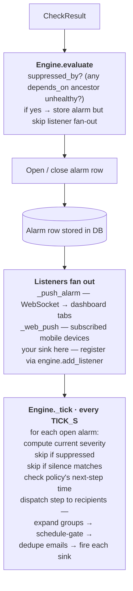

# Alarm engine

The piece that turns "this check failed" into "page the right
people." Read this when you want to add a custom alarm sink (Slack,
PagerDuty, SMS) or customize routing in ways the admin UI doesn't
expose.

**Companion**: [`92-glossary.md`](92-glossary.md) for the vocabulary
(route, recipient, policy, escalation step, suppression, severity).

---

## Architectural overview



The code lives in `backend/alarms/`:

- `engine.py` — the state machine + ticker.
- `router.py` — matches alarms against the route table.
- `models.py` — `AlertsConfig`, `Route`, `Receiver`, `Policy`.
- `suppression.py` — dependency-graph alarm suppression.
- `silences.py` — silence matchers.
- `conditions.py` — the "when" conditions on routes.
- `sinks/` — output channels (`email`, `webhook`, `console`).
- `templates/` — Jinja templates for email subject/body.

---

## Lifecycle of an alarm

1. **Check.run() returns a non-pass CheckResult.**
2. **`Engine.evaluate(result)`** is called by the scheduler:
   - If the run is an **inconclusive skip** (`payload.reason` is one
     of `upstream_unhealthy`, `local_dns_error`,
     `local_network_offline`), do nothing at all. The check declined
     to judge, so any open alarm is left exactly as it is and no new
     one opens. See [Inconclusive skips](#inconclusive-skips-are-not-recovery).
   - If `result.status` is `pass`, or an **intrinsic** skip (the check
     ran and legitimately had nothing to assess), and an alarm is open
     for this check_id+target, close it.
   - Otherwise, compute the initial severity from the status
     (`severity_for_status`), compute suppression (any unhealthy
     ancestor in `depends_on`?), and `store.open_alarm(...)`.
   - Emit an `alarm_open` event to all listeners.
3. **Listeners fan out** asynchronously:
   - `_push_alarm` → WebSocket → every connected dashboard.
   - `_web_push` → per-device push subscriptions (severity-floor +
     pattern-filter + schedule-gated).
   - Custom sinks you add via `engine.add_listener(...)`.
4. **`Engine._tick()` runs every `TICK_S` (default 15s)**:
   - Walks every open alarm.
   - Updates the latest_status cache (used by suppression).
   - Computes current severity (factoring duration-based
     auto-promotion from `warn` → `critical` after
     `PROMOTE_AFTER_S`, hard-coded at 30 min). This reads
     `status_at_open`, which lives in the alarm's payload — see the
     shape note under [Routes and policies](#routes-and-policies).
   - Matches the alarm against the route table; finds the policy.
   - Determines the next-step time (`policy.steps[next].delay_s`
     after the previous step fired).
   - If a step is due AND not suppressed AND no silence matches,
     dispatches.
5. **Dispatch resolves recipients**, expands groups (gated by each
   group's schedule), dedupes emails across overlapping groups +
   direct recipients in the step, and fires each configured sink.
6. **Ack closes the loop** — an acked alarm stops repeating even
   if it's still open. `_process` checks `is_acked` *before* it
   resolves a route, so an acked alarm dispatches nothing on any
   channel at any severity, `repeat_interval` re-sends included.
   Unack resumes.

    !!! warning "An ack binds to the alarm row, not to the check"
        `alarm_acks.alarm_id` references one specific alarm. Anything
        that closes and re-opens an alarm therefore **discards the
        ack**, and the replacement pages again. Before v0.2.1 a
        cascade demote closed alarms, so an ack on a permanently-down
        target was routinely destroyed within hours — production had
        acked `layer2.radar.XEBY` twice and every one of the five
        subsequent re-opens arrived unacked.

7. **Close** happens automatically when the check returns `pass` or
   an intrinsic skip, OR explicitly via the UI / API. An inconclusive
   skip does *not* close an alarm.

---

## Routes and policies

A **route** maps "alarms matching X" to "use policy Y." Defined in
`alerts.yaml` or in the DB (admin UI writes to DB):

```yaml
routes:
  - match:
      stage: "L2"
      status_at_open: "fail"
    when:
      duration_at_severity_min: 10
    policy: "page-oncall"
    severity_floor: "critical"
    repeat_interval: "1h"
    group_by: ["stage", "target"]
```

`router.match(alarm, ctx)` walks routes in order, returns the first
that matches (first-match-wins). The `ctx` dict carries
duration-since-open + peer-counts for the `when` conditions.

**Matchable keys are the `alarms` row's columns, plus its payload.**
`check_id`, `target`, `stage` and `severity` are real columns;
`status_at_open` lives inside the `payload` JSONB. `flatten_alarm()`
merges the payload underneath the row before matching, so both are
addressable by the same flat name. Columns win, so a stale payload can
never steer a route keyed on `stage` or `severity`.

!!! warning "A route that matches at open time may not have matched at dispatch time (fixed in v0.2.1)"
    Before v0.2.1 the flatten did not happen. `evaluate()` built a flat
    dict to resolve the hold-down, so a route keyed on `status_at_open`
    matched there; `_process()` passed the raw row, so the same route
    matched **nothing** when it came time to notify. `_process` reads
    `route is None` as "nothing configured" and returns — no error, no
    warning, no log line. The only symptom is an empty
    `notification_log`, which reads like "quiet week" rather than
    "broken router".

    Production ran a single `{status_at_open: error}` route: 537
    matching alarms opened in seven days and **zero** notifications
    were dispatched. `compute_severity` reads the same field, so
    duration-promotion to `critical` was dead for the same reason.

    **On upgrading past v0.2.1, re-read your route table before
    restarting.** Any route keyed on `status_at_open` has been inert
    and starts firing — `repeat_interval` included.

A **policy** is an ordered list of escalation steps:

```yaml
policies:
  - name: "page-oncall"
    steps:
      - receivers: ["oncall-rotation"]
        delay_s: 0
        severity_floor: "critical"
      - receivers: ["entire-ops-team"]
        delay_s: 900    # 15 min
```

Steps fire in order if the alarm is still open + unacked when each
delay elapses. `delay_s` is **between steps**, measured from when
the previous step fired.

### `repeat_interval`

Per-route, optional, no default. It re-sends a step that has already
fired, for as long as the alarm stays open; it does **not** advance
escalation. Timed per `(alarm_id, step_idx)` off the last send in
`notification_log`, and checked once per `TICK_S`, so a repeat lands
within ~15s of becoming due.

**Blank means never.** `_process` does `if not route.repeat_interval_s:
continue` — the step fires once for that alarm and never again. So
"tell me once, then leave me alone until it closes" needs no code
change, just an empty field. The admin UI at `/admin/alerts` exposes
it per route as **repeat every** (placeholder `1h (blank = no
repeat)`); it accepts `30s`, `15m`, `1h`, `2d`, or a bare number of
seconds.

Choose it against how long the alarm will plausibly stay open. A
30-minute repeat on a target that is down for a week is 336 emails,
and the second one has already told the reader everything the
336th will. Two things bound that in practice — an **ack** stops
repeats entirely (and, since v0.2.1, survives long enough to be
worth placing), and a **silence** stops them for a planned window.

---

## Recipients

A **receiver** is one row in the recipient table:

```yaml
receivers:
  - name: "oncall-rotation"
    emails: ["primary@example.com"]
    group_ids: [3]              # group #3 — the on-call team
  - name: "entire-ops-team"
    group_ids: [1, 2]           # multiple groups
```

At dispatch time:

1. Direct `emails` are gathered.
2. Each `group_id` is expanded — fetch the group row, evaluate
   `effective_is_active(group, now)` (the group's own schedule
   AND its parent's schedule), filter members to those on-duty,
   gather their emails.
3. Union + dedupe — one email address per step, even if it appears
   through multiple groups.

`effective_is_active` is in `backend/groups.py`. It composes the
group's schedule (always / weekly / biweekly) with all downtime
windows (one-off + recurring) and does the same for any parent group,
AND-merging the results.

---

## Suppression vs cascade demote

These are belt-and-suspenders for the same problem (cascading
failures), at different layers:

**Cascade demote** (`backend/scheduler.py`) acts at the **check
result** layer. If an ancestor is unhealthy, the downstream's
fail/error is rewritten to skip before it ever reaches the engine.
No alarm opens — and, since v0.2.1, no alarm *closes* either.

**Suppression** (`backend/alarms/suppression.py`) acts at the
**alarm** layer. If an alarm somehow does open for a downstream
(race condition, missing dep declaration), suppression sets
`alarm.suppressed_by = <ancestor_id>`. The engine's tick respects
the field — suppressed alarms don't escalate; no email, no push.

In normal operation, cascade demote handles everything and
suppression is a no-op. The latter exists for the edge cases.

### Inconclusive skips are not recovery

A cascade demote means **"we declined to judge"**, not "the target is
healthy". The distinction is invisible in the timeline — both render
as a gray skip cell — but it is load-bearing for the alarm engine,
and getting it wrong inverts the noise the demote exists to prevent.

Three consumers have to know the difference, and they read it through
`alarms.suppression.is_inconclusive()`:

| Consumer | If it treats a demote as healthy |
|---|---|
| `engine.evaluate()` | Closes the alarm — the dashboard reports a recovery that did not happen. |
| `store.non_pass_streak_start()` | Re-arms the hold-down from zero, so the target re-qualifies for a **new** alarm minutes later. |
| `engine._close_stale_acked()` | Counts a demote window as clean and retires an acked alarm that is still broken. |

Together those produced a loop that looked exactly like flapping on
things that were not flapping: alarm opens → an upstream blips → the
alarm closes → the blip ends → the hold-down re-arms → a fresh alarm
opens and escalation restarts at step 1. Because web push fires on
`alarm_open`, every lap was another notification about a state that
had never changed.

The tell is the ratio. A check that genuinely recovers now and then
has a low false-close rate; a permanently-down target has **100%** of
its closes falsified. In the seven days to 2026-09-05, `XEBY` opened
18 alarms and 17 of its 17 closes were cascade demotes — not one was
a real `pass`, and the radar had been continuously non-pass since
2026-07-18.

If you add a new demote reason in the scheduler, add it to
`INCONCLUSIVE_SKIP_REASONS` in the same commit.
`validation_tests/test_alarm_inconclusive_skip.py` drives the real
scheduler paths and will fail if a producer emits a reason the engine
does not recognise.

---

## Adding a custom sink

Sinks are async callables `(event_type, payload) -> None`.
Register via `engine.add_listener(...)`:

```python
async def my_slack_sink(event_type, payload):
    if event_type != "alarm_open":
        return
    # Same silence check the built-in sinks do — silences gate
    # engine._process, NOT listeners. Without this, sinks fire
    # even when an active silence should mute them.
    from backend.alarms import silences as _sil
    from datetime import datetime, timezone
    now = datetime.now(timezone.utc)
    active = await store.list_active_silences(now)
    if _sil.find_active_silence(active, payload, now):
        return
    # Build your message
    severity = (payload.get("severity") or "warn").lower()
    text = f"[{severity.upper()}] {payload['check_id']}/{payload['target']}: {payload['message']}"
    # Fire your HTTP call
    await httpx_client.post(SLACK_WEBHOOK_URL, json={"text": text})

# In app.py lifespan:
engine.add_listener(my_slack_sink)
```

**Critical: silences gate `engine._process`, NOT listeners.**
Listeners fire on `alarm_open` regardless of silences. Every sink
must check `find_active_silence(...)` itself before dispatching, or
it will leak pages during planned-maintenance silences.

The built-in `_web_push` listener in `backend/api/app.py` has the
silence check + every other gate (per-device routing, severity
floor, etc.) as the reference implementation. Mirror that pattern.

---

## Custom routing logic

Routes today are declarative (YAML or DB-edited). If you need
imperative routing — e.g. "during business hours route to ops, after
hours route to on-call, but during a known incident escalate
immediately to engineering" — extend `router.Router.match()`:

```python
class Router:
    def match(self, alarm: dict, ctx: dict) -> Route | None:
        # ... walk routes as usual ...
        # Then add custom logic:
        if alarm.get("severity") == "critical" and self._is_incident_active():
            return self._engineering_route
        return matched
```

Keep this thin. The declarative route table is much easier to
reason about than imperative routing logic; only escape to code
when YAML can't express what you need.

---

## Event types you can subscribe to

Listeners receive `(event_type, payload)`:

| Event type | Fired when | Payload shape |
|---|---|---|
| `alarm_open` | A new alarm row is created | `dict(alarm_row)` — every column |
| `alarm_close` | An alarm transitions to closed | `dict(alarm_row)` + `closed_at` |
| `alarm_promote` | Severity bumps (e.g. warn → critical) | `{id, severity}` |
| `alarm_ack` | An alarm gets acked | `{id, acked_by, note}` |
| `alarm_unack` | An ack gets reversed | `{id}` |

For the "I want to push to a chat channel when alarms open" case,
subscribe only to `alarm_open` (and possibly `alarm_close` for
recovery messages).

---

## Templating

Email rendering uses Jinja2 templates in `backend/alarms/templates/`:

- `default.txt` — plaintext body + subject
- `default.html` — HTML body

The context built by `backend/alarms/sinks/email.py:_build_ctx()`
includes:

- `severity`, `severity_upper`, `stage`, `stage_descriptor`, `target`,
  `check_id`
- `short_line` (one-line summary, trimmed to 90 chars)
- `what` (per-check-family one-paragraph explanation)
- `observed` (list of `(label, value)` tuples)
- `verify_urls` (list of `(label, url)` tuples)
- `captured_image_url` (L4 only — direct link to the captured PNG)
- `dashboard_url` (deeplink to the timeline filtered to this alarm)

To customize the email layout, edit the templates. The Jinja
syntax is permissive — add new blocks, conditionals, loops as needed.

---

## What to NOT do

- **Don't subscribe via `add_listener` without a silence check.**
  Listeners fire on alarm_open regardless of silences; you'll page
  through planned-maintenance silences.
- **Don't mutate the alarm row from inside a listener.** The engine
  is the single writer. Listeners are read-only consumers.
- **Don't do blocking I/O in a listener.** Every listener runs in
  the engine's task; a blocking call stalls all listeners + the
  next tick.
- **Don't bypass the route table for "VIP" alarms.** Use a route
  with a high-priority match instead. The route table is the only
  audit trail of who-gets-paged-for-what.
- **Don't add a sink that retries internally.** Sentinel doesn't
  retry on dispatch failures; if your sink does, you'll
  thunder-herd on transient outages. Log + drop.

---

## Where to go from here

- **[`14-extending-api.md`](14-extending-api.md)** — adding an
  endpoint that fires manual alarms (e.g. an external system
  posting incidents into Sentinel).
- **[`13-extending-checks.md`](13-extending-checks.md)** — the
  upstream of this pipeline.
- **[`92-glossary.md`](92-glossary.md)** — vocabulary refresher.
- **`backend/alarms/sinks/email.py`** — the most-fleshed-out sink,
  good template for new ones.
