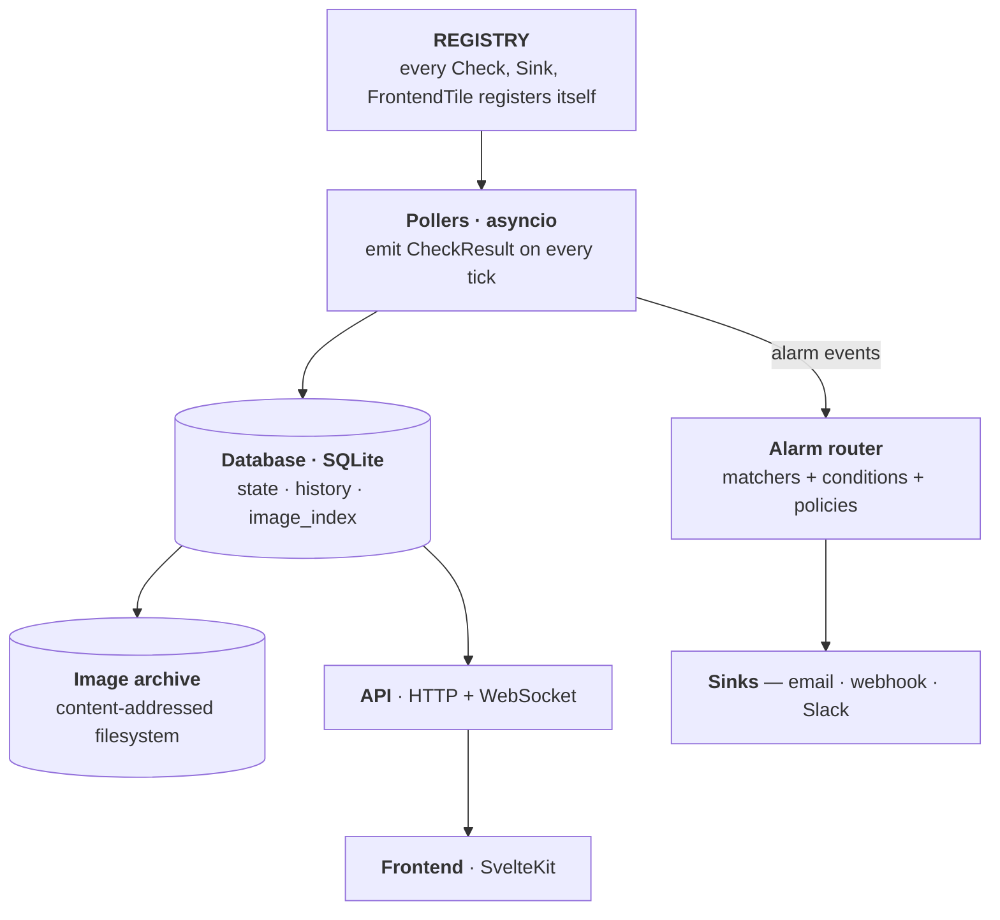
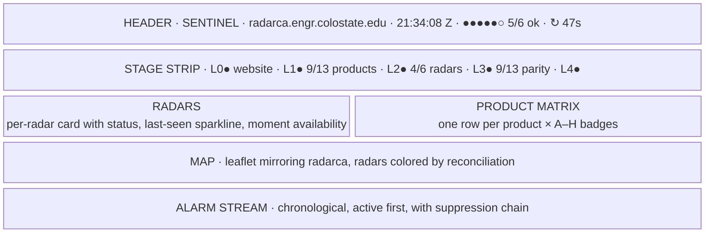
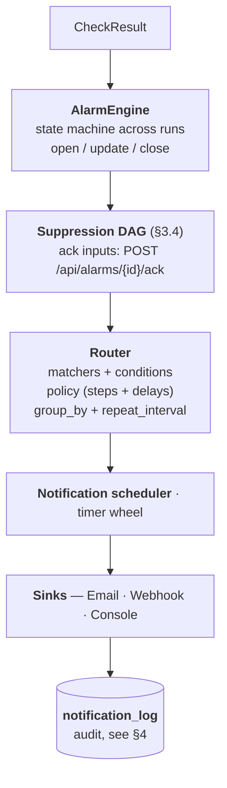
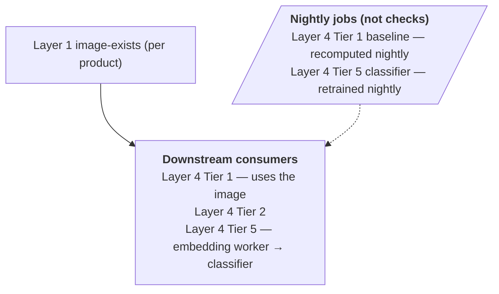
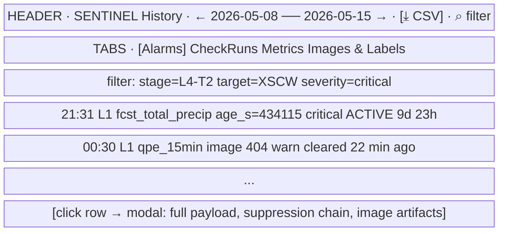

# Sentinel — full implementation plan

_Companion to `radarca-public-characterization.md` and `radarca-monitoring-plan.md`._

A monitoring system for `radarca.engr.colostate.edu`, deployed in three phases (local → Docker → live). Designed so new checks, new stages, and new check kinds can be added without touching the core — extensibility is a first-class constraint.

---

## 1. Goals & constraints

**Goals**

- Continuous, hierarchical health monitoring of every layer in the characterization doc.
- An operations-center web UI that exposes the *full* health state at a glance.
- Single-operator deployment on a home-lab cluster — no Kubernetes, no SaaS dependencies.

**Constraints**

- **Extensible** — adding a new check (or a new whole stage) must require: (1) a new file under `backend/checks/`, (2) a registry entry, (3) optionally a frontend tile that reads the same generic record shape. No DB migrations, no scheduler edits, no API edits.
- **Respect upstream** — never poll an endpoint faster than its native cadence.
- **Auditable** — every check result and every alarm transition persists. Re-run history.
- **Local-first** — everything works on a single machine before anything Dockerizes.

---

## 2. Stack

| Concern | Choice | Rationale |
|---|---|---|
| Backend language | Python 3.12 (existing venv) | Already in use; numpy/PIL/Playwright/imagehash all installed |
| HTTP framework | FastAPI + uvicorn | Async-native, WebSocket built-in, pydantic models double as DB schema |
| Scheduler | `asyncio` task per check + a tiny supervisor | No APScheduler — keeps the runtime debuggable, no DB-backed schedule state |
| Storage | **PostgreSQL 16** | Multi-writer ready from day one; rich JSONB for the generic `payload`; good full-text search on alarms; no migration churn later. Local: a single docker container. |
| Image archive | Filesystem, content-addressed by sha256 | No DB blobs; index in Postgres |
| Real-time push | WebSocket on the FastAPI app | Same process, no separate broker |
| Frontend | SvelteKit + Tailwind | Reactive primitives + low-ceremony; no shadcn default look |
| Map | **MapLibre GL JS + Stadia Maps tiles** (`stamen_toner_lite` or `alidade_smooth_dark`) | Vector tiles, retina-crisp, dark-mode native, much better aesthetic than raster OSM; pairs with the ops-center look |
| Charts | Hand-rolled SVG sparklines + uPlot for time series | uPlot is tiny, fast, and doesn't impose an aesthetic |
| Auth | **Session cookies (httpOnly, SameSite=Lax) + bcrypt passwords** + magic-link reset over SMTP | First-class admin gating; public dashboard stays unauthenticated. Details in §17. |
| Orchestration | docker-compose (Phase 2) | Three-container start (`backend`, `frontend`, `postgres`); sufficient for single-host |
| Reverse proxy | Caddy | Automatic Let's Encrypt; one-line vhost config |
| Browser automation | Playwright (already installed) | For Layer 3A overlay extraction |

---

## 3. Architecture — extensibility-first

Three layers, each independently extensible.



### 3.1 The `Check` interface (the extensibility hinge)

```python
# backend/checks/base.py
class Check:
    id: str                # unique slug, e.g. "layer1.product.comp_ref"
    stage: str             # grouping label, e.g. "L1", "L4-T1", or "L6" (future)
    target: str            # what's being checked, e.g. "comp_ref", "XSCW"
    cadence_s: int         # how often to run
    depends_on: list[str]  # check ids this one depends on (suppression DAG)

    async def run(self, ctx: CheckContext) -> CheckResult:
        ...
```

`CheckResult` is the universal envelope written to the DB:

```python
@dataclass
class CheckResult:
    check_id: str
    target: str
    stage: str
    status: Literal["pass", "warn", "fail", "skip", "error"]
    started_at: datetime
    finished_at: datetime
    summary: str           # one-line for UI
    payload: dict          # check-specific structured data (JSON-serializable)
    metrics: dict[str, float]   # extracted numerics for time-series
    artifacts: list[str]   # paths to saved files (screenshots, image hashes, etc.)
```

**Why this matters for extensibility:** a new check (or a whole new stage like "Layer 5 — radar artifact classifier") just adds a new Check subclass to `backend/checks/`. The scheduler picks it up via the registry, the API exposes it under `/api/checks/{stage}/{check_id}`, and the frontend can either render the generic tile (status + summary + sparkline of `metrics`) or a custom tile if the check kind benefits from one (Layer 4 will want a thumbnail; that's a custom tile, not a core change).

### 3.2 The registry

```python
# backend/registry.py
CHECKS: dict[str, Check] = {}
SINKS: dict[str, Sink] = {}

def register(check_cls):
    inst = check_cls()
    CHECKS[inst.id] = inst
    return check_cls
```

Each module under `backend/checks/` decorates its classes with `@register`. `backend/main.py` imports the directory and the registry self-populates. No central list to update.

### 3.3 Stages

The five layers from the plan become five stages: `L0`, `L1`, `L2`, `L3`, `L4`. But stages are just labels — adding `L5` for a learned-classifier check requires nothing in the core. A check's `stage` attribute groups it in the UI, controls the dependency graph default (`L1` suppresses `L4`), and lets the operator filter the dashboard.

### 3.4 Dependency / suppression graph

When a check enters `fail`, every check whose `depends_on` transitively includes it becomes *suppressed* — alarms still log but don't fire to sinks. This implements the hierarchical suppression from the monitoring plan without hardcoding the hierarchy. Default rule: every check depends on the website-alive check; Layer 4 checks depend on the corresponding Layer 1 image-exists check. Overridable per check.

### 3.5 Alerting engine

Sits between `CheckResult` transitions and the sinks. Rules-driven, declarative, hot-reloadable. Supports severity-based routing, time-based escalation, duration-based severity promotion, user-defined conditional predicates, acknowledgements, and scheduled silences. Full detail in §14.

### 3.6 History service

A read-only API surface + a frontend tab that browses any prior state of the system: alarm timeline, check-run audit, metric time-series, archived images, image labels. Retention is configurable per table. Full detail in §16.

### 3.7 Transport-agnostic checks

The `Check` interface deliberately specifies nothing about *how* a check obtains its signal. It's `async def run(ctx) -> CheckResult` — full stop. The current radarca-focused checks all happen to use HTTP, but the design has zero web-specific assumptions in the core. New transports plug in without touching the registry, scheduler, alarm engine, frontend, or DB schema.

`CheckContext` exposes a small set of injected clients, each lazily constructed:

| Transport | Client (in `ctx`) | Example future check |
|---|---|---|
| HTTP/HTTPS | `ctx.http` (httpx async client, cookie jar, retry policy) | the current Layer 0–3 checks |
| Headless browser | `ctx.browser` (Playwright page factory) | Layer 3A overlay extraction |
| Filesystem / mounted volume | `ctx.fs` (pathlib + stat helpers) | "last-touched timestamp of `/mnt/radar-archive/scwa/`", "min free space on `/data`" |
| SSH | `ctx.ssh(host)` (asyncssh session, key-auth from secrets) | "`uptime` on the radar VM", "tail of `/var/log/chivo.log`" |
| S3 / MinIO / object store | `ctx.s3(profile)` (aiobotocore session) | "newest object under prefix `xband_chivo/scwa/` is fresher than N minutes" |
| SNMP | `ctx.snmp(host, community)` | hardware health on the radar's network gear |
| Subprocess | `ctx.shell(cmd, timeout)` | `rclone check`, `restic snapshots`, anything CLI |
| Database probe | `ctx.db(dsn)` | "Postgres query returns within budget" |
| Prometheus / metrics scrape | `ctx.prom(url)` | bridge external metrics in |

Anything missing is added by writing one adapter in `backend/checks/transports/` and adding it to the `CheckContext` factory — a one-time, ~50-line addition per transport. The Check class itself just takes a dependency on `ctx.<thing>` and emits the same `CheckResult` envelope.

**Why this matters for the user's example** ("checking a storage cluster for file heartbeats"): a "last touched" check on a mounted NFS volume is a single new file:

```python
# backend/checks/infra_archive_freshness.py
@register
class ArchiveFreshness(Check):
    id     = "infra.archive.scwa_freshness"
    stage  = "INFRA"                     # new stage label — UI auto-creates the column
    target = "scwa-archive"
    cadence_s = 120
    depends_on = []                      # not dependent on the website

    async def run(self, ctx):
        st = await ctx.fs.stat("/mnt/radar/scwa/")
        age = (now() - st.st_mtime).total_seconds()
        status = "pass" if age < 300 else "fail"
        return CheckResult(
            ...,
            metrics={"age_s": age, "newest_size_bytes": st.newest_size},
            payload={"path": "/mnt/radar/scwa/", "newest_file": st.newest_name},
        )
```

The dashboard's stage strip auto-adds an "INFRA" cell. The generic `<CheckTile>` renders a sparkline of `age_s`. Alarms route through the same engine, so the same email-with-escalation policies apply.

---

## 4. Data model

The schema is intentionally generic so new check kinds don't need migrations. Postgres dialect; JSON payloads use `JSONB` (indexable, queryable).

```sql
-- one row per check execution
CREATE TABLE check_runs (
  id            BIGSERIAL PRIMARY KEY,
  check_id      TEXT NOT NULL,
  target        TEXT NOT NULL,
  stage         TEXT NOT NULL,
  status        TEXT NOT NULL,           -- pass/warn/fail/skip/error
  started_at    TIMESTAMPTZ NOT NULL,
  finished_at   TIMESTAMPTZ NOT NULL,
  summary       TEXT,
  payload       JSONB,                   -- check-specific structured data
  artifacts     TEXT[]                   -- relative paths under /data
);
CREATE INDEX idx_run_check  ON check_runs(check_id, started_at DESC);
CREATE INDEX idx_run_stage  ON check_runs(stage, started_at DESC);
CREATE INDEX idx_run_target ON check_runs(target, started_at DESC);
CREATE INDEX idx_run_payload_gin ON check_runs USING GIN (payload);

-- normalized time-series for chart plotting (consider TimescaleDB hypertable
-- if/when volumes grow; not required for v1)
CREATE TABLE metric_samples (
  ts            TIMESTAMPTZ NOT NULL,
  check_id      TEXT NOT NULL,
  target        TEXT NOT NULL,
  metric        TEXT NOT NULL,           -- e.g. "age_s", "coverage_pct"
  value         DOUBLE PRECISION NOT NULL
);
CREATE INDEX idx_ms_lookup ON metric_samples(check_id, target, metric, ts DESC);

-- alarm lifecycle (open/clear, with suppression record)
CREATE TABLE alarms (
  id            BIGSERIAL PRIMARY KEY,
  check_id      TEXT NOT NULL,
  target        TEXT NOT NULL,
  stage         TEXT NOT NULL,
  severity      TEXT NOT NULL,           -- info/warn/critical
  opened_at     TIMESTAMPTZ NOT NULL,
  closed_at     TIMESTAMPTZ,
  suppressed_by TEXT,                    -- check_id that suppressed (null if fired)
  message       TEXT NOT NULL,
  payload       JSONB
);
CREATE INDEX idx_alarms_open ON alarms(opened_at DESC) WHERE closed_at IS NULL;
CREATE INDEX idx_alarms_target ON alarms(target, opened_at DESC);

-- content-addressed image archive
CREATE TABLE image_archive (
  sha256        TEXT PRIMARY KEY,
  ext           TEXT NOT NULL,           -- "png"
  size_bytes    INTEGER NOT NULL,
  width         INTEGER,
  height        INTEGER,
  first_seen_at TIMESTAMPTZ NOT NULL,
  last_seen_at  TIMESTAMPTZ NOT NULL,
  origin_url    TEXT                     -- the upstream /api/imageData URL
);

-- maps timestamped scans to archive entries (many-to-one)
CREATE TABLE image_observations (
  ts            TIMESTAMPTZ NOT NULL,
  product_id    TEXT NOT NULL,           -- "comp_ref" or "xband:scwa:CorrReflectivity"
  scan_ts       TIMESTAMPTZ NOT NULL,    -- the scan's own timestamp (not fetch time)
  sha256        TEXT NOT NULL REFERENCES image_archive(sha256),
  PRIMARY KEY (product_id, scan_ts)
);
CREATE INDEX idx_obs_recent ON image_observations(product_id, ts DESC);

-- alerting state (see §14)
CREATE TABLE alarm_acks (
  alarm_id      BIGINT NOT NULL REFERENCES alarms(id) ON DELETE CASCADE,
  acked_by      TEXT NOT NULL,           -- references users.email (logged-in admin)
  acked_at      TIMESTAMPTZ NOT NULL,
  note          TEXT,
  revoked_at    TIMESTAMPTZ,
  PRIMARY KEY (alarm_id, acked_at)
);

CREATE TABLE notification_log (
  id              BIGSERIAL PRIMARY KEY,
  alarm_id        BIGINT NOT NULL REFERENCES alarms(id) ON DELETE CASCADE,
  sent_at         TIMESTAMPTZ NOT NULL,
  receiver        TEXT NOT NULL,         -- receiver name from config
  channel         TEXT NOT NULL,         -- email/webhook/console/...
  escalation_step INTEGER NOT NULL,
  template        TEXT,
  body_excerpt    TEXT,                  -- first 500 chars
  delivery_status TEXT NOT NULL,         -- queued/sent/failed
  error           TEXT
);
CREATE INDEX idx_notif_alarm ON notification_log(alarm_id, sent_at DESC);

CREATE TABLE silences (
  id            TEXT PRIMARY KEY,        -- human-readable slug
  matchers      JSONB NOT NULL,
  starts        TIMESTAMPTZ NOT NULL,
  ends          TIMESTAMPTZ NOT NULL,
  reason        TEXT,
  created_at    TIMESTAMPTZ NOT NULL,
  created_by    TEXT                     -- references users.email
);
CREATE INDEX idx_silences_window ON silences(starts, ends);

-- Tier 4 corpus + classifier (see §15)
CREATE TABLE image_embeddings (
  sha256        TEXT NOT NULL REFERENCES image_archive(sha256) ON DELETE CASCADE,
  model_id      TEXT NOT NULL,           -- e.g. "dinov2-vits14-onnx-v1"
  embedding     BYTEA NOT NULL,          -- packed float32 (1.5 KB for 384-dim)
  computed_at   TIMESTAMPTZ NOT NULL,
  PRIMARY KEY (sha256, model_id)
);

CREATE TABLE image_labels (
  id            BIGSERIAL PRIMARY KEY,
  sha256        TEXT NOT NULL REFERENCES image_archive(sha256) ON DELETE CASCADE,
  label         TEXT NOT NULL,
  confidence    REAL NOT NULL DEFAULT 1.0,
  source        TEXT NOT NULL,           -- "human" / "classifier:<model_id>"
  created_at    TIMESTAMPTZ NOT NULL,
  created_by    TEXT                     -- references users.email
);
CREATE INDEX idx_labels_sha    ON image_labels(sha256);
CREATE INDEX idx_labels_label  ON image_labels(label);

-- rolling baselines for Tier 1 anomaly detection
CREATE TABLE metric_baselines (
  check_id      TEXT NOT NULL,
  target        TEXT NOT NULL,
  metric        TEXT NOT NULL,
  hour_of_day   SMALLINT NOT NULL,        -- 0..23, separate baseline per hour
  mean          DOUBLE PRECISION NOT NULL,
  stddev        DOUBLE PRECISION NOT NULL,
  n_samples     INTEGER NOT NULL,
  computed_at   TIMESTAMPTZ NOT NULL,
  PRIMARY KEY (check_id, target, metric, hour_of_day)
);

-- auth (see §17)
CREATE TABLE users (
  id            BIGSERIAL PRIMARY KEY,
  email         TEXT NOT NULL UNIQUE,
  password_hash TEXT,                    -- bcrypt; NULL allowed for invite-pending
  role          TEXT NOT NULL DEFAULT 'admin',   -- 'admin' | 'viewer' (future)
  display_name  TEXT,
  created_at    TIMESTAMPTZ NOT NULL DEFAULT now(),
  last_login_at TIMESTAMPTZ,
  disabled_at   TIMESTAMPTZ
);

CREATE TABLE sessions (
  id            UUID PRIMARY KEY DEFAULT gen_random_uuid(),
  user_id       BIGINT NOT NULL REFERENCES users(id) ON DELETE CASCADE,
  created_at    TIMESTAMPTZ NOT NULL DEFAULT now(),
  last_seen_at  TIMESTAMPTZ NOT NULL DEFAULT now(),
  expires_at    TIMESTAMPTZ NOT NULL,
  user_agent    TEXT,
  ip            INET
);
CREATE INDEX idx_sessions_user ON sessions(user_id);

CREATE TABLE password_reset_tokens (
  token         TEXT PRIMARY KEY,        -- HMAC-signed
  user_id       BIGINT NOT NULL REFERENCES users(id) ON DELETE CASCADE,
  issued_at     TIMESTAMPTZ NOT NULL DEFAULT now(),
  expires_at    TIMESTAMPTZ NOT NULL,
  used_at       TIMESTAMPTZ
);

-- signed ack tokens for one-click email-ack links
CREATE TABLE ack_tokens (
  token         TEXT PRIMARY KEY,        -- HMAC-signed; encodes alarm_id + exp
  alarm_id      BIGINT NOT NULL REFERENCES alarms(id) ON DELETE CASCADE,
  issued_at     TIMESTAMPTZ NOT NULL DEFAULT now(),
  expires_at    TIMESTAMPTZ NOT NULL,
  used_at       TIMESTAMPTZ
);

-- audit log for admin actions (covers config edits, ack/unack, silences, user mgmt)
CREATE TABLE admin_audit (
  id            BIGSERIAL PRIMARY KEY,
  at            TIMESTAMPTZ NOT NULL DEFAULT now(),
  user_email    TEXT NOT NULL,
  action        TEXT NOT NULL,           -- "ack_alarm" | "create_user" | "edit_alerts" | ...
  target        TEXT,
  payload       JSONB
);
CREATE INDEX idx_audit_user ON admin_audit(user_email, at DESC);
CREATE INDEX idx_audit_action ON admin_audit(action, at DESC);
```

**Adding a new check kind requires zero schema changes** — the structured payload lives in `payload_json` and extracted numerics in `metric_samples`. The UI either renders the generic tile (status + summary + sparkline of any metric in `metric_samples`) or a custom tile that knows that check's payload shape.

Tables added above are for *cross-cutting concerns* (alerting, history, ML) that all checks plug into. New checks don't write to these directly — the alarm router and the archive/embedding workers do.

---

## 5. API surface

```
# live state
GET  /api/status                          → top-level rollup {stages, counts, freshness}
GET  /api/stages                          → all stage summaries
GET  /api/checks                          → all registered checks (metadata only)
GET  /api/checks/{id}/latest              → most recent CheckRun for id
GET  /api/checks/{id}/history?since=...   → time-bounded history
GET  /api/checks/{id}/metrics?metric=...&since=...
                                          → time-series for charts

# alarms + acknowledgement + silences (see §14)
GET  /api/alarms?status=open|closed|silenced|all
GET  /api/alarms/{id}                     → full record + suppression chain + ack state
POST /api/alarms/{id}/ack                 → {user, note}; pauses escalation
POST /api/alarms/{id}/unack               → revoke an ack
GET  /api/silences                        → active + scheduled silences
POST /api/silences                        → {matchers, starts, ends, reason}
DELETE /api/silences/{id}
GET  /api/notifications?alarm_id=...&since=...   → audit log of what fired
POST /api/alerts/reload                   → hot-reload alerts.yaml; returns validation result

# image archive + labels (see §15, §16)
GET  /api/image/{sha256}                  → archived PNG bytes
GET  /api/image/observations/{product}/latest
                                          → metadata for the latest scan
GET  /api/image/observations/{product}?since=...&until=...
                                          → enumerate archived scans in range
GET  /api/labels?label=...&since=...      → labeled corpus rows
POST /api/labels                          → {sha256, label, note}; recorded as source="human"
DELETE /api/labels/{id}

# history (see §16)
GET  /api/history/alarms?since=...&until=...&stage=...&target=...&severity=...
GET  /api/history/checks?...              → CheckRun rows with filters
GET  /api/history/export.csv?type=alarms|checks&...   → streaming CSV

# push
WS   /api/ws                              → multiplexed events
                                            {type:"check_run"|"alarm_open"|"alarm_close"|"alarm_ack"|"silence_added"|"status_rollup"|"reload_ack", ...}
```

The frontend opens a single WebSocket on mount; the API multiplexes all live events onto it. REST endpoints back history and on-demand drill-downs.

---

## 6. Frontend — operations center

### 6.1 Design language

**Inspiration:** Bloomberg Terminal · TradingView watchlists · NWS NEXRAD ops viewer · Linear dark · weather-radar level-II viewers.

**Anti-patterns to avoid** (so it doesn't drift toward generic):
- No gradient hero. No card-grid landing. No marketing language.
- No `rounded-2xl shadow-xl` on every container. Tight 1px borders instead.
- No emoji status. Glyphs (▲ ▽ ◢ ●) or colored dots only.
- No centered single-column layout. Density across the viewport is the point.

### 6.2 Tokens

```
/* color */
--bg-canvas      #0a0a0b   /* near-black, faint warmth */
--bg-surface     #13141a   /* panels */
--bg-elevated    #1a1c23   /* hover/focus */
--border         #1f2127   /* hairlines */
--border-strong  #2a2d36
--text-default   #e5e7eb
--text-muted     #6b7280
--text-bright    #fafafa

/* status */
--ok        #22c55e        /* matches NWS green */
--warn      #f59e0b
--fail      #ef4444
--info      #38bdf8
--suppress  #6b7280        /* alarms that exist but aren't firing */

/* dBZ-inspired accents for data viz (mirrors comp_ref colormap) */
--dbz-1  #4b006e   --dbz-2  #2e3192   --dbz-3  #0080ff
--dbz-4  #00c800   --dbz-5  #fff000   --dbz-6  #ff7f00
--dbz-7  #d90000   --dbz-8  #ff00ff   --dbz-9  #ffffff

/* typography */
--font-display "Berkeley Mono", "Geist Mono", ui-monospace
--font-numeric "Geist Mono", ui-monospace, tabular-nums
--font-prose   "Inter Tight", system-ui
```

Numerics always render with `font-variant-numeric: tabular-nums` so columns of numbers line up.

### 6.3 Information architecture

One page, four panes — no router-driven SPA navigation. Drill-down is an inline expand, not a page change.



Below the fold (scroll): per-radar Layer 4 panel — thumbnail of latest scan + Tier-1 metrics + Tier-2 verdicts.

**Auth-driven chrome.** The dashboard is **publicly viewable** (no login). Anonymous visitors see everything in the live view, the history view, and the alarm timeline — read-only. Admin-only controls render as additional affordances when a session cookie is present: ack/unack buttons on alarm rows, "edit alerts" / "manage silences" / "label image" / "add user" buttons in the relevant panels. A small `[ log in ]` link sits in the header for anonymous visitors; logged-in admins see their email + a `[ log out ]` link in the same slot. Full auth detail in §17.

### 6.4 Component catalog

Every dynamic surface is one of these reusable primitives:

| Component | Role |
|---|---|
| `<StatusDot status>` | 6 px colored dot, optional pulse on transition |
| `<StatusBadge>` | `● UP` / `▽ DOWN` / `◇ SUPPRESSED` chip |
| `<Sparkline data height=18>` | hand-rolled SVG, 30–60 datapoints |
| `<Metric label value unit trend>` | tabular numeric with optional ▲/▽ delta |
| `<CheckTile check>` | the universal tile — works for any check kind because it reads from CheckResult + metric_samples |
| `<ProductRow product>` | dense single-line view of all sub-checks A–H |
| `<RadarCard radar>` | one card per radar w/ declared/observed/moments |
| `<MapView verdicts>` | **MapLibre GL JS** with **Stadia Maps** tiles (`alidade_smooth_dark` style); radar circles overlaid as GeoJSON sources with paint expressions keyed to verdict |
| `<AlarmRow alarm>` | one-line alarm with severity, age, suppression source |

**Key extensibility move:** because `CheckTile` consumes the generic `CheckResult`, every new check renders correctly in the UI even before any custom component is written for it. Custom tiles are an upgrade, not a requirement.

### 6.5 Motion

Almost none. Data swaps in place (no fade). The only animations are:
- 0.4 s pulse on a `StatusDot` when it changes state
- 1 s sweep on the header reload icon when the WS reconnects

No skeleton loaders. If data is missing, show the previous value with a `stale` flag.

---

## 7. Phase 1 — Local development

**Goal:** `make dev` brings up backend + frontend; the UI shows real data from radarca within 30 s of launch.

### 7.1 Repo layout (under `SentinelProject/`)

```
backend/
  __init__.py
  config.py                  # shared with current test scripts
  registry.py
  scheduler.py
  checks/
    base.py
    layer0_website.py
    layer1_product.py        # parameterized: one Check instance per product
    layer1_vector.py
    layer1_stream.py
    layer2_radar.py          # parameterized: one per radar
    layer3_filename.py
    layer3_overlay.py        # Playwright; opt-in via env flag
    layer4_tier1_stats.py
    layer4_tier2_heuristics.py
  db/
    schema.sql
    store.py                 # connection pool + write helpers
    migrations.py            # for any future schema evolution
  api/
    app.py                   # FastAPI app
    routes_status.py
    routes_checks.py
    routes_alarms.py
    routes_images.py
    ws.py
  alarms/
    router.py                # CheckResult → Alarm transitions
    suppression.py           # DAG-based suppression
    sinks/
      console.py
      email.py
      webhook.py
  archive/
    writer.py                # content-addressed PNG store
    sweeper.py               # retention
  main.py                    # uvicorn entry: API + scheduler in one process

frontend/
  package.json
  svelte.config.js
  tailwind.config.ts
  src/
    app.html
    app.d.ts
    routes/
      +layout.svelte         # header, stage strip, WS bootstrap
      +page.svelte           # the four-pane dashboard
      alarms/+page.svelte    # full alarm history (optional drill-down)
      checks/[id]/+page.svelte
    lib/
      api.ts                 # typed fetch wrapper
      ws.ts                  # WebSocket store
      stores/                # svelte stores for status, alarms, checks
      components/
        StatusDot.svelte
        StatusBadge.svelte
        Sparkline.svelte
        Metric.svelte
        CheckTile.svelte
        ProductRow.svelte
        RadarCard.svelte
        MapView.svelte
        AlarmRow.svelte
      tokens.css
    styles/app.css

ops/
  docker-compose.yml
  Dockerfile.backend
  Dockerfile.frontend
  Caddyfile

data/                        # gitignored
  sentinel.db
  images/                    # sha256/aa/bb/aabbcc….png
  screenshots/               # Layer 3A evidence
scripts/
  dev.sh                     # spawns backend + frontend concurrently
  seed.sh                    # backfill a few minutes of data for UI dev
Makefile
.env.example
README.md
```

### 7.2 Build order

1. **Skeleton + registry** — `backend/registry.py`, `Check` base class, one trivial check (the website-alive). Verify scheduler runs it and persists.
2. **DB layer** — `db/schema.sql` + `db/store.py`. Verify check_runs persists and is queryable.
3. **Port test scripts to Check classes** — wrap each `test_layerN_*.py` into one (or many parameterized) Check subclasses. Each existing test → identical functionality + registry registration.
4. **Alarm router** — translate `pass/fail` transitions on CheckResult into open/close on `alarms`. Suppression via DAG.
5. **API** — FastAPI app exposing the endpoints in §5. Smoke-test with `curl`.
6. **WebSocket** — push every CheckResult and alarm transition.
7. **Frontend bootstrap** — SvelteKit init, tokens.css, layout, WS store. Hardcode test data first.
8. **Frontend live** — wire all components to the WS + REST endpoints. Pre-populate from REST on load; mutate on WS events.
9. **Polish pass** — sparklines, motion budget, density audit. Compare against the §6.3 mockup.

Phase 1 done when: a fresh checkout + `make dev` shows the same operational truth as the test scripts, but live and continuous, with no per-check UI changes required to add the next check.

---

## 8. Phase 2 — Dockerization

**Goal:** `docker compose up` does what `make dev` does, on any host with Docker.

### 8.1 Images

| Image | Base | Contents |
|---|---|---|
| `sentinel-backend` | `python:3.12-slim` + Playwright deps | Backend code, scheduler, API, Chromium |
| `sentinel-frontend` | `node:20-alpine` (build) → `nginx:alpine` (serve) | Static SvelteKit build (adapter-static, since the dashboard talks WS, not SSR) |

If SSR matters later (it doesn't for an internal dashboard), switch the frontend to `node:20-alpine` runtime with `adapter-node`. Static is simpler and faster.

### 8.2 docker-compose

Single host, three services:

```yaml
services:
  backend:
    build: { context: ., dockerfile: ops/Dockerfile.backend }
    volumes:
      - ./data:/app/data           # sentinel.db + image archive
    environment:
      - SENTINEL_BASE=https://radarca.engr.colostate.edu
      - SENTINEL_DB=/app/data/sentinel.db
      - SENTINEL_ARCHIVE=/app/data/images
    healthcheck:
      test: ["CMD", "curl", "-f", "http://localhost:8000/api/status"]

  frontend:
    build: { context: ., dockerfile: ops/Dockerfile.frontend }
    depends_on: [backend]

  proxy:
    image: caddy:2-alpine
    ports: ["80:80", "443:443"]
    volumes:
      - ./ops/Caddyfile:/etc/caddy/Caddyfile:ro
      - caddy_data:/data
      - caddy_config:/config
volumes: { caddy_data: {}, caddy_config: {} }
```

### 8.3 What changes from Phase 1

Almost nothing. The backend already serves the API on `:8000`; frontend already builds static. The only adjustments:
- Pollers must respect `SENTINEL_*` env vars rather than hardcoded paths.
- Playwright must use `chrome-headless-shell` baked into the image (avoid downloading on first run).
- Image archive moves under `/app/data/images` (mounted volume).

Phase 2 done when: `docker compose down && up` resumes exactly where it stopped (state persisted), and the frontend reaches the same state as Phase 1.

---

## 9. Phase 3 — Deployment to your home cluster

**Goal:** a stable URL — `sentinel.<your-domain>` — serving the dashboard, with TLS, persisting through reboots.

### 9.1 Steps

1. Pick the host on your cluster. Allocate ≥ 5 GB for the image archive and 100 MB for SQLite.
2. Point a DNS A record at it.
3. Caddyfile vhost:
   ```caddy
   sentinel.example.com {
       reverse_proxy /api/* backend:8000
       reverse_proxy /api/ws backend:8000
       reverse_proxy frontend:80
   }
   ```
   Caddy fetches the cert automatically.
4. Configure systemd unit (or your existing container orchestrator) to start the compose project on boot.
5. Set up backup: nightly `sqlite3 .backup` to a sibling file + `rsync` of the image archive (or skip the archive — it's regenerable).
6. Configure alarm sinks (optional, see §10).

### 9.2 Operational metrics to track on the host itself

- Disk free (image archive grows ~600 MB/day worst-case)
- Backend memory (Playwright on Layer 3A holds a Chromium; budget 400 MB)
- SQLite size — vacuum monthly

---

## 10. Extension hooks (the scalability story)

Each of these is the *only* place you touch when extending:

| What you're adding | Where it goes | Other code that changes |
|---|---|---|
| A new check (e.g. a 6th-layer ML artifact classifier) | a new module under `backend/checks/`, registered via `@register` | none |
| A new whole stage (e.g. "L5 — anomaly classifier", "INFRA — storage cluster") | same as above; pick a new `stage` label | UI auto-creates a column in the stage strip from `/api/stages` |
| A new metric on an existing check | emit it in the check's `CheckResult.metrics` dict | a Sparkline will auto-render when the UI requests `?metric=<new>` |
| **A new transport** (SSH / S3 / SNMP / filesystem / Prom / subprocess) | one adapter in `backend/checks/transports/`, wire into `CheckContext` factory | none — checks then `await ctx.<new>(...)` |
| A new alarm sink (Discord, ntfy, PagerDuty, SMS) | new file under `backend/alarms/sinks/`, register a class | reference the sink by name in `alerts.yaml` receivers |
| A new alarm condition predicate (e.g. `cluster_quorum_lost`) | new file under `backend/alarms/conditions/`, register | reference by name in `alerts.yaml` routes |
| A new product/radar | a row in `config.py` | check classes that iterate `PRODUCTS` / `RADAR_FOLDER` pick it up |
| A custom frontend tile for a check kind | a new `*.svelte` component + a mapping in `CheckTile.svelte` | falls back to generic tile if missing |
| A new dependency edge | declare `depends_on` on the check | suppression DAG recomputes automatically |
| A new escalation policy / receiver | edit `alerts.yaml`; hot-reload via `POST /api/alerts/reload` | none |

Anti-checklist (these are *signs* of a leaky abstraction; if you find yourself doing them, the design is wrong):

- Touching `scheduler.py` to add a check
- Touching `api/routes_*.py` to add a check
- Adding a column to a SQL table to support a new check kind
- Adding a hardcoded if/else for a stage label

---

## 11. File layout cheat sheet for new code

When you add a check, the only files you create or edit:

```
backend/checks/<your_check>.py          # new
backend/config.py                       # only if it iterates over a registry you're extending
frontend/src/lib/components/<Tile>.svelte   # optional, custom UI
frontend/src/lib/components/CheckTile.svelte   # add one line: kind→component map
```

Nothing else.

---

## 12. Roadmap & rough effort

Numbers assume one focused engineer working evenings, not full-time.

| Milestone | Scope | Est. |
|---|---|---|
| **P1.1** Skeleton | registry, scheduler, DB, transport adapters, one trivial check, FastAPI hello | 1 evening |
| **P1.2** Port Layer 0–3B | wrap existing test scripts as Checks; suppression DAG | 2 evenings |
| **P1.3** Alerting engine v1 | rules-driven router + email sink + ack endpoints + silences (§14) | 2 evenings |
| **P1.4** Frontend bootstrap | SvelteKit init, tokens, header + stage strip + product rows on REST | 2 evenings |
| **P1.5** WebSocket live | push CheckResult + alarms; frontend reacts; ack button | 1 evening |
| **P1.6** Layer 4 T1/T2 + Layer 3A | image stats, heuristics, Playwright overlay | 2 evenings |
| **P1.7** History view | filters, time scrubber, CSV export, image browser (§16) | 2 evenings |
| **P1.8** Polish + density | sparkline calibration, alarm stream, map view, motion budget | 2 evenings |
| **P2** Dockerize | two-image compose + Caddy proxy + volumes | 1 evening |
| **P3** Deploy | host setup, DNS, TLS, systemd, backup, SMTP creds | 1 evening |
| **P4.1** Layer 4 T3 | cross-radar overlap geometry + consistency check | 2 evenings |
| **P4.2** Layer 4 T4 | dual-pol moment alignment + consistency rules | 2 evenings |
| **P4.3** Layer 4 T5 (shadow) | ONNX encoder + embeddings table + labeling UI; classifier *not* alarming yet | 2 evenings |
| **P4.4** Layer 4 T5 (live) | nightly retrain job + classifier check goes from shadow to active once corpus seeded | 1 evening + ongoing labeling |

≈ 15 evenings to v1 (Phases 1–3). Layer 4 Tier 3–5 layered on top (~7 evenings + label-gathering). Non-web transports / new stages are pluggable at any point with no v1 rework.

---

## 13. Decisions still open

The big choices are committed (Postgres + email-capable sinks + permanent-by-default retention + public dashboard with admin auth + MapLibre/Stadia). The remaining open items:

1. **Stadia tier / API key** — Stadia's free tier covers low-traffic dashboards (200 k tiles/mo). For this scale that's ample. Set `STADIA_API_KEY` in env; the frontend reads it from `/api/config/public`.
2. **Secrets management** — recommendation: `.env` (gitignored) for local + Docker; `sops`-encrypted file on the deployed host. Skip Vault.
3. **SMTP provider** — recommendation: a transactional sender (Postmark / SES / Fastmail SMTP) over a personal Gmail. Better deliverability and avoids 2FA dances.
4. **Tier 5 model storage** — recommendation: keep model files out of git (`models/.gitkeep` + an export recipe script); avoid LFS.
5. **Backfill of historical data on first deploy** — recommendation: no backfill. The system starts learning from `now`. Optional: a one-shot importer for the last 24 h.
6. **Whether to expose the public dashboard to the public internet at all** — option A: keep on home LAN / Tailscale and skip the question. Option B: expose with Caddy + the admin auth in §17 gating only writes. The plan supports both; pick at deploy time.

If you want different choices on any of these, the plan absorbs them without restructuring.

---

## 14. Alerting subsystem (targeted email + escalation)

Routes `CheckResult` transitions to people via a configurable rules engine. Inspired by Alertmanager but lighter; declarative YAML, hot-reloadable, with first-class acknowledgements and conditional predicates.

### 14.1 Pipeline



### 14.2 Config (`config/alerts.yaml`)

```yaml
smtp:
  host: smtp.fastmail.com
  port: 587
  starttls: true
  username: ${SMTP_USER}              # env-interpolated
  password: ${SMTP_PASS}
  from: "Sentinel <sentinel@yourdomain.example>"
  reply_to: "ops@yourdomain.example"

receivers:
  - name: oncall-primary
    email: ["you@example.com"]
  - name: oncall-fallback
    email: ["you@example.com", "partner@example.com"]
  - name: ops-channel
    webhook: ${DISCORD_WEBHOOK_URL}
    template: discord_compact          # see §14.5
  - name: console-only
    console: true                      # logs but does not send

escalation_policies:
  - name: standard
    steps:
      - delay: 0m
        receivers: [oncall-primary]
      - delay: 15m                     # if still unacked
        receivers: [oncall-primary, ops-channel]
      - delay: 60m
        receivers: [oncall-fallback]

  - name: hard-page                    # for L0 / site-down
    steps:
      - delay: 0m
        receivers: [oncall-primary, ops-channel]
      - delay: 5m
        receivers: [oncall-fallback]

  - name: chat-only
    steps:
      - delay: 0m
        receivers: [ops-channel]

conditions:                            # named reusable predicates
  business_hours:
    time_of_day_in: "08:00-20:00"
    timezone: "America/Los_Angeles"
    weekday_only: true
  long_outage:
    duration_at_severity_min: 30
  pair_outage:
    count_of_targets_failing: ">=2"

routes:                                # first match wins
  - match: {stage: L0}                 # website / origin down
    severity_floor: critical
    policy: hard-page
    repeat_interval: 10m
    group_by: [check_id]

  - match: {stage: L1}
    when: {any: [{ref: long_outage}, {ref: business_hours}]}
    severity_floor: warn
    policy: standard
    repeat_interval: 60m
    group_by: [stage, target]

  - match: {stage: L2, status: fail}
    when: {ref: pair_outage}           # only page when ≥ 2 radars down
    severity_floor: critical
    policy: standard

  - match: {stage: L2, status: fail}   # single radar down — chat only
    policy: chat-only
    repeat_interval: 4h

  - match: {stage: L4-T5}              # only critical artifact classifications
    when: {confidence: ">=0.85"}
    severity_floor: critical
    policy: standard

  - match: {}                          # catch-all
    policy: chat-only
    repeat_interval: 12h

silences:                              # static; runtime silences via API
  - id: csu-maintenance-2026-05-20
    matchers: {stage: L1}
    starts: 2026-05-20T09:00:00Z
    ends:   2026-05-20T13:00:00Z
    reason: "CSU planned maintenance"
```

### 14.3 Severity, duration, and conditional escalation

Severity is computed from `CheckResult.status` plus runtime modifiers:

| Status | Default severity |
|---|---|
| `pass` | clears |
| `warn` | warn |
| `fail` | warn at first, **promotes to critical after 30 min** (configurable per route) |
| `error` | warn (check itself broke, not the target) |

The "30 min" auto-promotion is the **duration-based** escalation. The `when:` clauses on routes are the **conditional** layer (time-of-day, target count, custom predicates). Routes' `policy.steps[].delay` is the **time-based** escalation.

These three knobs compose. Example: an L2 single-radar outage starts as `warn` → chat-only. If it lasts 30 min, it promotes to `critical` and the catch-all route stops matching (a higher-priority route does). If two radars are down, the `pair_outage` condition kicks in immediately at `critical`. If acked, escalation pauses regardless.

### 14.4 Acknowledgements & silences

- `POST /api/alarms/{id}/ack` — `{user, note}` recorded; pauses pending escalation steps for the alarm's lifetime.
- Ack auto-expires when the alarm closes; it must be re-acked if the alarm re-opens.
- `POST /api/silences` — matchers + time window. Matching alarms still appear in the UI with a `silenced` badge; nothing dispatches.
- Both the UI alarm row and the email body include a one-click ack link (signed token, valid for the alarm's lifetime, no auth UI needed).

### 14.5 Email template

Plain-text and HTML, Jinja2 (already in the SvelteKit-adjacent Python toolchain via Jinja or starlette templates). One template per receiver; the default is dense:

```
[SENTINEL CRITICAL]  L1  fcst_total_precip  10d stale
Stage:        L1 — Per-product / per-endpoint health
Check:        layer1.product.fcst_total_precip
Target:       fcst_total_precip
Severity:     critical (promoted from warn after 30m)
Opened:       2026-05-15 21:31:00Z   (9d 23h ago)
Last value:   age_s = 863280 (threshold 7200)
Suppressing:  —
Dashboard:    https://sentinel.example.com/#/check/layer1.product.fcst_total_precip
Acknowledge:  https://sentinel.example.com/api/alarms/4217/ack?t=<signed-token>

Recent run payload (truncated):
{ "n_steps": 130, "last_ts": "2026-05-11T00:00:00", ... }
```

No marketing chrome. Subject line is the matter-of-fact one-liner above.

### 14.6 Hot reload

`POST /api/alerts/reload` validates `alerts.yaml`, dry-runs the new routes against all currently-open alarms, and returns either `{ok: true, diff: {...}}` or `{ok: false, errors: [...]}` without swapping. If `ok`, the new config is atomically installed.

### 14.7 Recommended starter conditions

You won't write every condition; this set covers most needs and the rest is YAML composition:

- `time_of_day_in: "HH:MM-HH:MM"` (+ optional `timezone`, `weekday_only`)
- `time_of_day_not_in: ...`
- `duration_at_severity_min: N` — alarm has been at >= current severity for N minutes
- `count_of_targets_failing: "<op><n>"` — N targets currently `fail` on this `check_id`
- `count_of_stages_failing: "<op><n>"` — N distinct stages currently `fail`
- `pair_match: [target_a, target_b]` — both must be failing simultaneously
- `metric_above: {metric: "age_s", value: 3600}` — last sample exceeds value
- `confidence: ">=0.85"` — for ML classifier outputs in Layer 4 Tier 5
- `ref: <named_condition>` — reference a `conditions:` block
- `all:` / `any:` / `not:` — composition

Adding a new predicate: drop a file under `backend/alarms/conditions/`, register, reference by name. No core changes (see §10).

---

## 15. Layer 4 — full Tier 1–5 implementation

Five Check classes, each independent. Tier 1 and Tier 2 are already validated by the test scripts; the rest builds on the same architecture.

### 15.1 Tier 0 — labeled corpus (continuous, no Check class)

Not a Check — a *worker* that subscribes to image fetches by Layer 1/2 and routes them into the content-addressed archive (`image_archive` + `image_observations`). Cost: one sha256 + one stat per scan.

**Storage layout:**
```
/data/images/<sha256[0:2]>/<sha256[2:4]>/<sha256>.png
```

**Retention:** 7 days for unlabeled, forever for labeled (or referenced by an open alarm). Sweeper runs hourly.

**Label classes** (seed set, extensible):

```
healthy_clear
healthy_weather_stratiform
healthy_weather_convective
benign_clutter_ground
benign_clutter_sea
benign_clutter_bio
benign_external_cband_interference
broken_uniform_noise
broken_range_ring
broken_sector_blackout
broken_frozen_frame
broken_extreme_saturation
broken_unknown_artifact
```

### 15.2 Tier 1 — coarse statistical anomaly (validated)

Check class: `Layer4Tier1Stats`, one instance per (radar, moment).

Metrics emitted per scan: `coverage_pct`, `mean_value`, `std_value`, `autocorr`, `phash_hamming_to_previous`, `top1_bin_share`.

Baselines: stored in `metric_baselines` table, keyed by (check_id, target, metric, hour_of_day). Computed nightly from the last 7 days. Initial alarm threshold: ±3σ; per-metric override in `config.py`.

### 15.3 Tier 2 — heuristic pathology (validated)

Check class: `Layer4Tier2Heuristics`. Sub-detectors run in sequence; verdict is the worst of {OK, ANOMALOUS, FAULT}. Per-product thresholds.

### 15.4 Tier 3 — cross-radar consistency

**Geometry setup (once at startup):** from `RADAR_COORDS`, project each radar's coverage disc to EPSG:3857 (a circle of `range_m` around `(lat, lon)`). Compute the pairwise intersections — the polygons where two radars should agree.

**Per-scan check** (cadence: 2 min, same as radar scans):

1. Fetch the latest CorrReflectivity PNG for each healthy X-band radar and the same scan for NEXRAD where reachable.
2. Each PNG has a known `imageExtent` (parse from the JS bundle once or fit from samples) — use it to map pixel coords to EPSG:4326, then to 3857.
3. For each radar pair, sample the overlap polygon at ~100 m grid: invert the dBZ colormap (we have `colormap_ref.png`) on each radar, compute mean absolute difference.
4. Per radar, aggregate over pairs to a single `cross_radar_outlier_score` metric.

Alarm: outlier score > 2× rolling baseline for ≥ 3 consecutive scans → fail. Names the suspect radar in the payload.

Dependencies: `colormap_ref.png` inversion utility lives in `backend/imaging/colormap.py`; reused by Tier 4.

### 15.5 Tier 4 — dual-pol moment consistency

**Per scan, per X-band radar** (cadence: 2 min, conditional on radar being UP):

Fetch the same scan timestamp across all available moments (Z, Zdr, ρhv, FilteredPhiDP, Velocity). They're already aligned to a common grid by the upstream pipeline.

Compute consistency rules over the radar disc:

| Signature | Heuristic |
|---|---|
| One-channel dead | Zdr standard deviation across the disc < 0.1 dB |
| Electronics fault | ρhv distribution has > 80% mass < 0.5 in regions where Z is met-class (5–40 dBZ) |
| Phase fold | ΦDP histogram has a sharp peak at ±180° |
| Velocity dealiasing failure | Velocity has a saturated symmetric bimodal distribution |
| Moment-time desync | Different moments report different `scan_ts` for the "same" scan |

Each rule emits a named metric; the verdict is `fault` if any rule trips. Per-radar payload includes which rule(s) tripped, used by the email body.

**Caveat from current state:** as found in Layer 2 testing, all X-band radars currently report 0 RhoHV images. Until that's resolved upstream, Tier 4 ρhv-dependent rules emit `skip` (not `fail`) — a real signal vs a false alarm.

### 15.6 Tier 5 — learned classifier

**Encoder:** DINOv2 ViT-S/14, exported once to ONNX. Stored in `models/dinov2-vits14.onnx` (~85 MB). Inference via `onnxruntime` on CPU; ~500 ms per 224×224 image; embeddings are 384-dim float32 (1.5 KB each).

**Embedding worker:** subscribes to `image_archive` inserts; embeds and writes to `image_embeddings`. Idempotent (sha256-keyed).

**Labels:** UI in the History view (§16) shows recent scan thumbnails + class buttons. Each click writes an `image_labels` row with `source="human"`.

**Classifier:** scikit-learn logistic regression (or shallow MLP if needed) trained nightly:

1. Pull all `(embedding, label)` pairs from the last 90 days.
2. Stratified train/val split.
3. Fit; report per-class precision/recall; save to `models/classifier-v<N>.joblib`.
4. Atomically swap into the live classifier.

**Check class:** `Layer4Tier5Classifier`. Two modes:

- **Shadow** (default until corpus seeded): embed + classify + log to `check_runs`, but never alarm. The dashboard shows the prediction with a "shadow" badge so the operator can build intuition before going live.
- **Live**: alarm when the predicted class starts with `broken_*` AND confidence ≥ a per-class threshold AND the same class is sustained ≥ 3 consecutive scans.

**Cold start:** the system is useful from day one even without labels — Tier 1/2/3/4 cover the obvious failures; Tier 5 accrues capability as labels arrive.

**Seeding from heuristic output:** when Tier 2 flags a frame as `broken_frozen_frame` or `broken_extreme_saturation`, auto-label it with `source="classifier:tier2"` and `confidence=0.7`. This bootstraps the broken-class side of the dataset without manual effort. Healthy frames need human confirmation.

### 15.7 Dependency chain across tiers



If a product's image-exists check fails, all Layer 4 tiers for that product are suppressed (DAG, §3.4) — no noise.

---

## 16. Historical data access

### 16.1 Goals

- Replay any point in the system's history (last 30 days for runs, longer for alarms).
- Filter and search across alarms and check runs.
- Plot any metric across an arbitrary time range.
- Browse and label archived images (the Tier 5 input).
- Export filtered results to CSV.

### 16.2 Frontend

A second top-level route, `/history`, replacing the four-pane live dashboard with a four-tab history workspace. Same dark-ops aesthetic; the only new chrome is a sticky time-range scrubber at the top.



### 16.3 Tabs

- **Alarms** — filterable list; row → detail modal showing full lifecycle (open / acks / escalations sent / close).
- **CheckRuns** — raw audit log; same filters; rows are denser.
- **Metrics** — multi-line uPlot. Pick check + target + metric; overlay multiple series; brush to zoom.
- **Images & Labels** — thumbnail grid keyed by product/radar + scan_ts. Click → modal with full image + class buttons + a one-line note. Filter by label, by confidence, by current classification. This is the Tier 5 training UI.

### 16.4 API surface

Already in §5. The `/api/history/*` endpoints are deliberately separate from the live endpoints because they target large result sets and benefit from a different cache policy (live = no-cache; history = strong ETags).

### 16.5 Retention (permanent by default, fully configurable)

Every table defaults to **forever**. Operators can shorten retention per-table in `config.py`; the sweeper runs hourly with a configurable budget so it never blocks ingestion. Storage cost is bounded by deliberate choices upstream (sha256-dedup for images, JSONB compression for payloads) rather than retention.

| Table | Default | Approx. growth | Notes |
|---|---|---|---|
| `check_runs` | forever | ~25 k rows/day per stage at full check cadence | JSONB compresses well; ~150 MB/year |
| `metric_samples` | forever | ~200 k rows/day | Candidate for TimescaleDB hypertable + native compression if/when size matters (~1 GB/year uncompressed) |
| `alarms` | forever | sparse | small |
| `alarm_acks` | forever | sparse | small |
| `notification_log` | forever | sparse | audit value increases with age |
| `silences` | forever | sparse | small |
| `image_archive` | forever | ~560 MB/day worst case → **~200 GB/year** | The expensive one. Override to `keep_days=N` or `keep_labeled_only=True` for storage-constrained deployments. |
| `image_observations` | forever | one row per scan archived | small |
| `image_embeddings` | forever | 1.5 KB/image → ~300 MB/year | reusable across classifier retrains |
| `image_labels` | forever | tiny | core training asset |
| `metric_baselines` | rolling 1 month (recomputed nightly) | tiny | derived data, not historical |
| `admin_audit` | forever | sparse | governance record |

For storage-bound deployments, override defaults in `config.py`:

```python
RETENTION = {
    "image_archive":  {"keep_days": 90, "keep_labeled_forever": True},
    "metric_samples": {"keep_days": 365, "downsample_after_days": 30},
    # everything else stays forever
}
```

Sweeper resilience: deletes are batched (`DELETE ... WHERE id IN (... LIMIT 1000)`) inside short transactions so concurrent inserts aren't blocked. Image archive sweeper also unlinks the file from disk inside the same transaction so the DB and the FS never drift.

### 16.6 Export & API access for outside tools

- `GET /api/history/export.csv` streams filtered CSVs; useful for ad-hoc analysis or sharing with Chandra's group.
- `/api/checks/{id}/metrics` returns JSON time-series compatible with Grafana's "infinity" datasource — if you ever want to point Grafana at this for arbitrary dashboards, it works without changes.

---

## 17. Auth & RBAC

**Public dashboard, admin-gated mutations.** Anonymous visitors can see everything; only authenticated admins can change anything.

### 17.1 Threat model & posture

- The dashboard's read endpoints expose data that's already available from `radarca.engr.colostate.edu` — same origin material, no new sensitivity. Public-by-default is safe.
- Write endpoints (acks, silences, label submissions, alerts.yaml edits, user management) need an authenticated admin session.
- The Layer-4 corpus of archived radar imagery is also public-by-default — same reasoning. (If a particular product becomes sensitive, the `payload` JSONB on `check_runs` could be redacted per-stage in the read API; not needed v1.)
- Email-ack one-click links use HMAC-signed tokens (in `ack_tokens`) — convenient action without forcing a login flow from a mobile email client.

### 17.2 Login flow

- Email + password, bcrypt-hashed (`password_hash` in `users`). Argon2id is the better algorithm; bcrypt is fine and the Python ecosystem support is one-line. Pick `passlib[bcrypt]` for v1.
- Session token: cryptographically-random UUID stored in `sessions`, returned as an `HttpOnly; Secure; SameSite=Lax` cookie named `sentinel_session`. TTL: 30 days, refreshed on every request.
- Backend middleware: parses cookie → looks up session → annotates request with `request.state.user` (or anonymous). Admin-only routes use a FastAPI dependency that raises 401 if not present.
- Password reset: `POST /api/auth/forgot {email}` issues a single-use `password_reset_tokens` row, emails a link valid 1 hour. `POST /api/auth/reset {token, new_password}` consumes it.
- No 2FA / MFA in v1. Easy to layer in later (TOTP secret column on `users` + `pyotp` for verification).

### 17.3 Endpoints

```
# anonymous-readable
GET  /api/status, /api/stages, /api/checks/**, /api/alarms (GET only),
GET  /api/history/** (GET only), /api/image/**, /api/labels (GET only)

# admin-only (POST/PUT/DELETE)
POST /api/alarms/{id}/ack, POST /api/alarms/{id}/unack
POST /api/silences,         DELETE /api/silences/{id}
POST /api/labels,           DELETE /api/labels/{id}
POST /api/alerts/reload     (also requires a successful YAML validation)
POST /api/users,            PATCH /api/users/{id},  DELETE /api/users/{id}
POST /api/users/{id}/invite (admin sends a magic invite email; recipient sets a password)

# auth itself
POST /api/auth/login    {email, password} → sets session cookie
POST /api/auth/logout   → clears cookie + revokes server-side session
POST /api/auth/forgot   {email}
POST /api/auth/reset    {token, new_password}
GET  /api/auth/me       → {email, role, display_name} or 401
```

The one-click ack link is a special-cased GET endpoint that consumes a signed `ack_tokens` row, even when no cookie is present:

```
GET /api/alarms/{id}/ack?t=<token>   → 302 to /alarms/{id} with a flash banner
```

### 17.4 Initial admin bootstrap

The DB ships empty. On first run, if `users` is empty AND `SENTINEL_BOOTSTRAP_EMAIL` is set in env, the backend emits a one-time password-reset link to the console log and to that email (if SMTP is configured). After the first admin sets their password, subsequent users are invite-only.

CLI for explicit operator setup:

```
$ sentinel users add ops@example.com           # creates pending user, emits a reset link
$ sentinel users disable old@example.com
$ sentinel users list
```

### 17.5 RBAC depth (v1 vs later)

For v1, two roles:
- **anonymous** — read everything
- **admin** — full write

Two-role is enough for a small operations group. The `users.role` column is in place so we can split out later without migrations:
- **viewer** (logged in but read-only — useful for audit trails on who looked at what)
- **operator** (write to acks/silences/labels but not user management)
- **admin** (everything)

Adding a role: a value in `users.role`, an enum check in middleware, and per-endpoint annotations (`@requires(role="operator")`).

### 17.6 Admin UI surfaces

A handful of admin-only routes inside `/admin/*`:

| Route | Purpose |
|---|---|
| `/admin/users` | List + invite + disable users |
| `/admin/alerts` | View / edit / hot-reload `alerts.yaml` (a YAML editor with live validation against the API) |
| `/admin/silences` | Create / extend / delete silences |
| `/admin/audit` | Search `admin_audit` |
| `/admin/checks` | Inspect each Check's config, force-run, mute/unmute (a soft per-check disable separate from silences) |

The main `/` and `/history` pages render admin affordances (ack buttons, label buttons, edit buttons) inline only when a session is present — no separate UI shell.

### 17.7 Audit

Every admin write goes through one chokepoint that records to `admin_audit` (action, target, payload, user, timestamp) before returning a 2xx response. Three knock-on benefits:

- "Who acked this alarm 6 weeks ago?" is one query.
- Compliance-style trails for shared CSU-internal deployments.
- Suspicious activity (mass ack, mass silence) becomes a check you can trigger an alarm from — meta-monitoring.

### 17.8 What's *not* in v1

- SSO (Google / SAML / OAuth) — easy to add later via `authlib` if you ever federate.
- Per-radar permission scoping ("user X can only ack XSCV's alarms") — premature.
- API keys for programmatic access — admins can use their session cookie via `curl --cookie`; add real keys if a script consumer appears.
